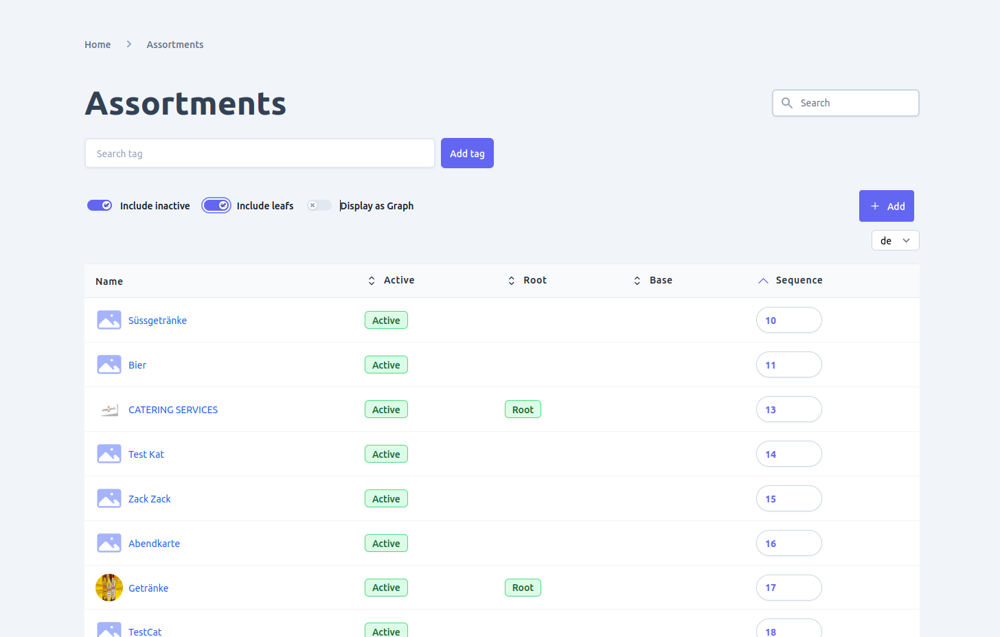
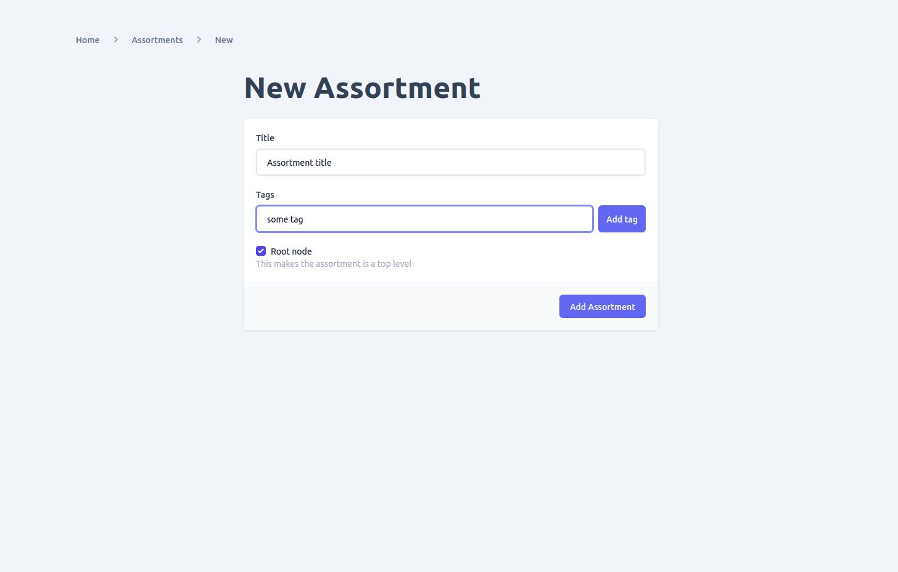
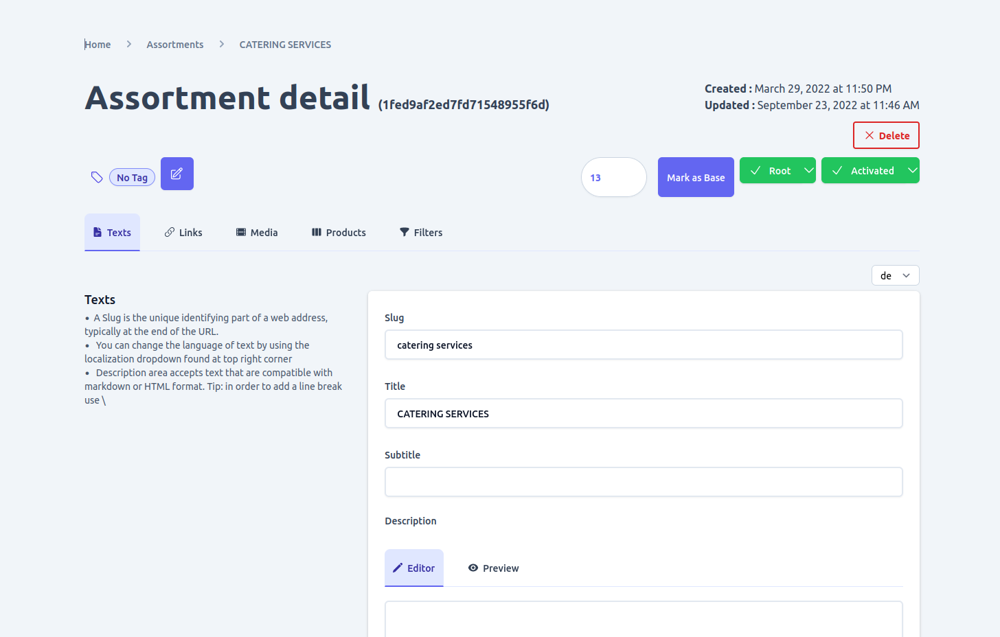
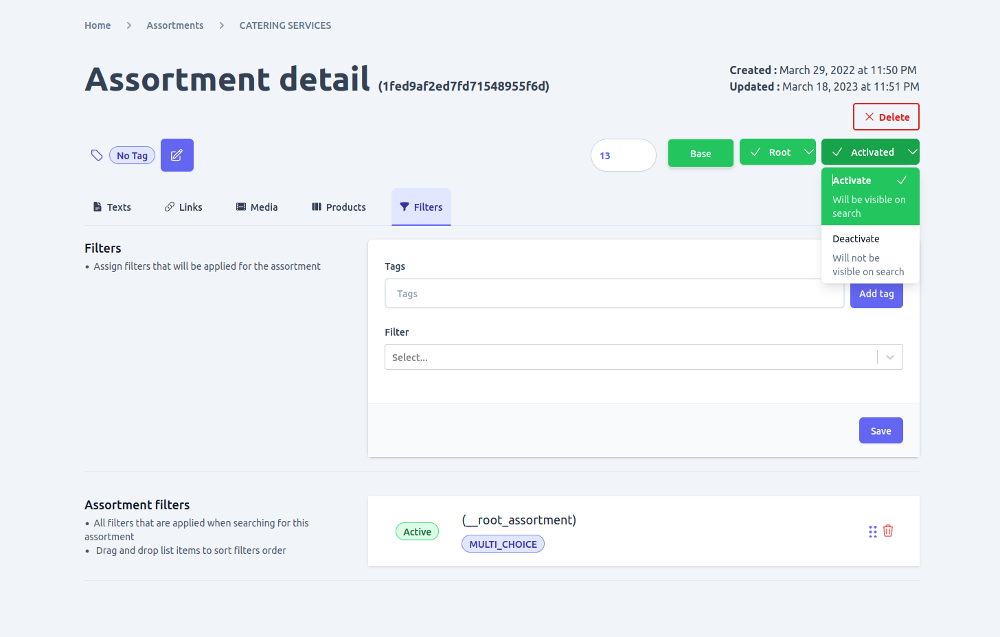
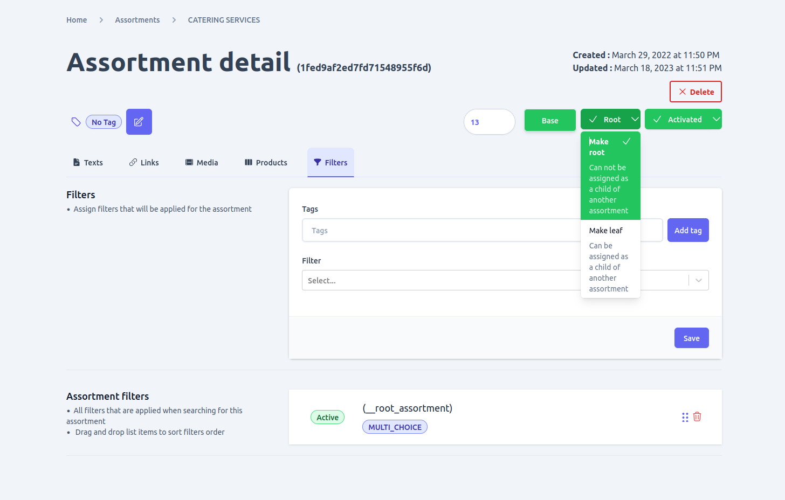
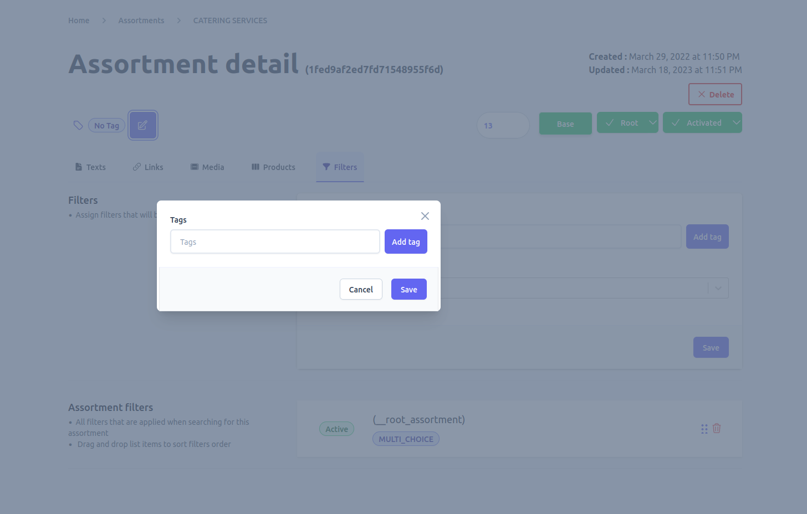
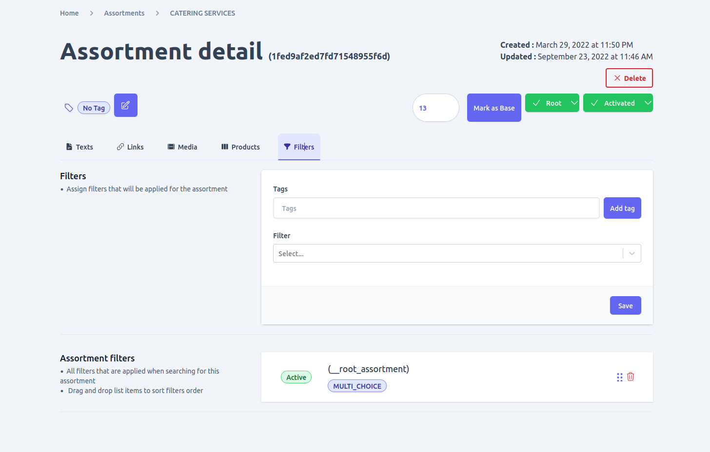
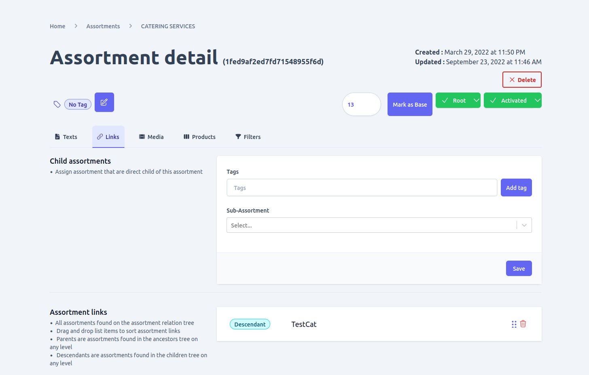
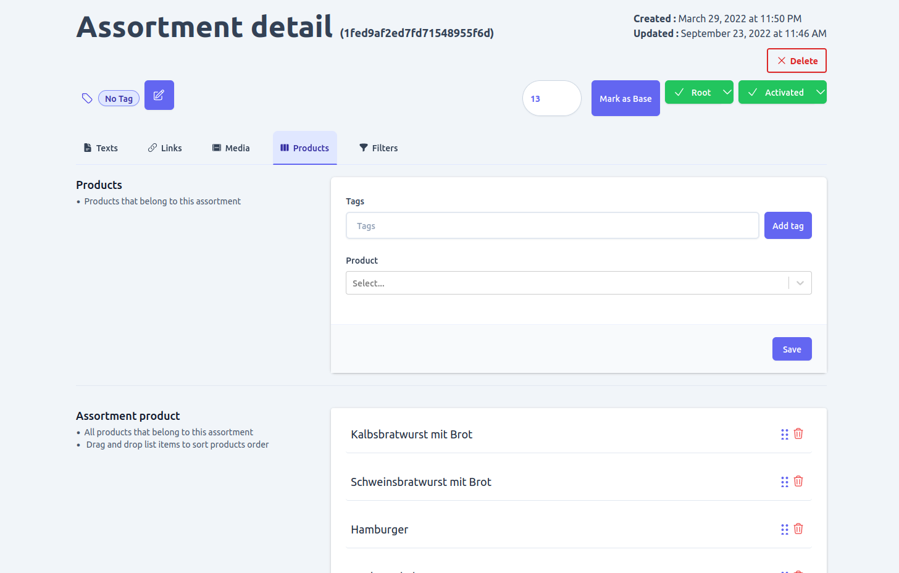

If you have various categories of products in your shop you probably want to organize them properly so the customer of your shop have easy time navigating through them all. In unchained can create assortments or categories to do just that and Amin ui helps you mange them easily.

Using the admin UI you can perform task related with category management including:
- Viewing and search and/or filtering them with different parameters
- Add, edit and delete categories
- Assign filters 
- Assign products
- Assign media
- Link assortments to create a hierarchy between them
- Activate or deactivate assortment and many more

## View and filter assortments
when you go to assortments page using the navigation link you will be presented with a list of categories that exists in the shop.
By default only active root assortments are visible but you can toggle that using any of the available toggle button according to your needs to change that. You can also view assortments as a graph to gain a better insight of their hierarchy using the toggle provided.

Additionally you can search, filter and/or sort assortments using various parameters such as their tags, name status and more.



### Add, edit and delete assortment
1. ### Adding new Assortment
Adding a category can be done with a user that has the privilage by clicking on the **Add** button found the the list view of assortments which will redirect you to the assortment creation form page.

2. ### Edit assortment
By Clicking on a assortment you can open it's detail view page where you can edit its text information including adding additional localized counter part for each.
Note that in-order to add a localized text for a assortment you need to [add the language](./language/#add-language) first by navigating to the language page.

3. ### Delete assortment
A user with the required privilage can delete an assortment by using the delete button found on the assortment detail page. However be extra couscous as the operation is not reversible and if other part of the shop is linked to assortment it might lead to unintended  problems.


4. ### Activating or deactivating assortment
On the assortment detail page you will find a button that displays the current status of an assortment. You can use the same button to toggle the status.




5. ### Root or leaf
You can change the placement of a assortment from root to leaf or the other way around using the button that displays the current value in regards to this to toggle to the other value.



6. ### Make base
Base assortment are top level assortments that can not be assigned as a child assortment of another. if an assortment was not initially added as base you can make it base by navigating to the assortment detail page. 
**Note: This action is not reversible.**

7. ### Edit assortment tags
You can manage the tags assigned to a assortment using the tag section found at the top of the assortment detail page.You can ass and delete tag of an assortment as needed.



### Manage assortment Medias
By navigating to the **Media** tab found in assortment detail page you can Upload, edit and delete medias of an assortment. An assortment can have multiple media files assigned to it if necessary and also supports localized texts for each media


### Manage assortment Filters
By navigating to the **Filter** tab found in assortment detail page you can Add or remove links to [filters](./filter) to a assortment.


### Manage assortment Links
By navigating to the **Links** tab found in assortment detail page you can Add or remove links to other assortments. A assortment can be assigned as a child as long as it is not a base assortment type, in this case base assortments can only have children but not assigned as a child to another.
**Note: A none root assortment can be a assigned as a child to multiple assortment with the only restriction being that it should not be part of the same assortment link parent hierarchy as this will create a cyclic relationship which is not currently supported by unchained. look into the illustration below for clarification**
```
//Not allowed X
a -> b -> c -> a

//Allowed
a -> b -> c
a -> c
```


### Manage assortment Filters
To add a product into a assortment navigate to the **Products** tab found in the assortment detail page. There you will be able to assign multiple products to a assortment. 
**Note: a product can belong to multiple categories and there is no restriction in that**


