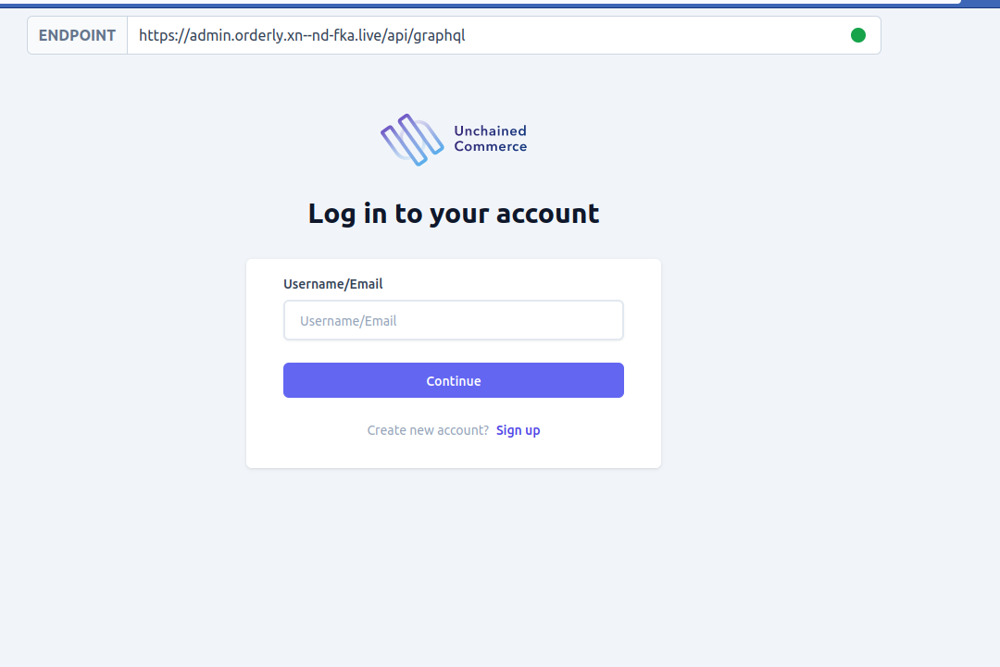
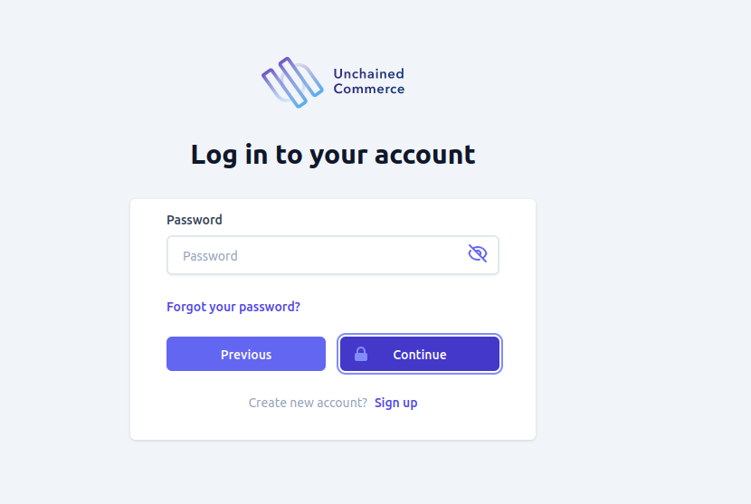

Unchained engine supports multiple authentication flows users can use to register and access it. The admin ui is designed to support most of this authentication and authorization flows with the exception of some that are better suited to a storefront instead of a control panel.

# Registration
Users can create an account by clicking on the sign up button found on the log in page using either [web authentication](https://webauthn.guide/) or normal email and password registration flow

## Email and password registration
You can create an account by providing a unique `email` and `password` an an optional `username`

if all the validation passes you will be automatically redirected to the home page and successfully logged in

## Web Authn registration

Unchained supports one of the latest and most safest registration method. [Web authn](https://webauthn.guide/) 
is a strong authentication system that enables you to authenticate your serf to the system using a hardware key, finger print or retina that is unique to you only. this also means that your password will not be store in the engine unlike the traditional methods.

To register using [Web authn](https://webauthn.guide/) go to the sign up page and select  the **use authenticator** toggle. After that all you need to provide is a unique username that is not already used by another user in the system. when you submit a username you will be asked to authenticate yourself using any method (finger print, retina, hardware key, etc...) and on successful registration you will be redirected to the home page as a logged in automatically.

# Authentication
You can authenticate yourself on admin UI using either email and password plus [TOTP/Time based one time password](https://en.wikipedia.org/wiki/Time-based_one-time_password) (if enabled) or with [Web authn](https://webauthn.guide/) also if enabled
## Login with email and password (TOTP)

To login into your account in admin UI, first, enter email or username and click continue. if your username is found in the system you will be prompted with a password field.

Once you enter a valid password if you have not enabled [TOTP/Time based one time password](https://en.wikipedia.org/wiki/Time-based_one-time_password) you will be redirected to the home page as a logged in user. 
On the other hand,if you have enabled TOTP you will be provided another input to enter the time-based generated number as a last step in which, after entering the correct number you will be redirected to the home page as a logged in user.

## Login with Web authn
If you have previously configured [Web authn](https://webauthn.guide/) for your account you will only need to provide a valid username on the same input you would enter your email if you was login in with email and password method. Admin UI will determine if the submitted user has enabled [Web authn](https://webauthn.guide/) or not in the background, in which on a successful valid username submission you will be prompted to authenticate yourself using the same medium you have configured  [Web authn](https://webauthn.guide/) with previously. 

After a successful authentication you will be redirected to the home page as a logged in user.
