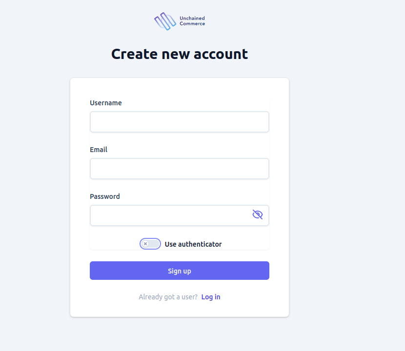
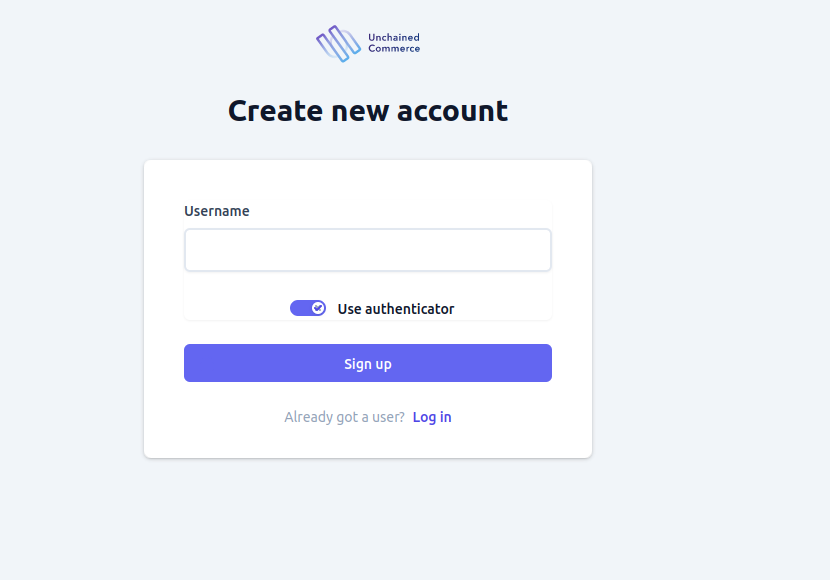

Unchained engine offers several authentication flows to users to register and access the platform. The admin UI is designed to support most of these authentication and authorization flows. However, some authentication flows are more suitable for a storefront than a control panel, and hence, the admin UI may not support them.

# Registration
Users can create an account by clicking on the sign up button found on the log in page using either [web authentication](https://webauthn.guide/) or normal email and password registration flow
To create a user account, users can click on the "sign up" button located on the login page. Two registration options are available:
1. [Web Authentication](https://webauthn.guide/): This method allows users to register their account using their device's built-in security features, such as a fingerprint scanner or facial recognition. This provides an added layer of security, as it eliminates the need for a password.
2. Email and Password Registration Flow: Users can also choose to create an account using the traditional email and password registration process. They will need to enter a valid email address and a secure password of their choice to proceed.

It is important to note that both registration options require users to provide valid and accurate information to create an account. Additionally, users should be advised to choose a strong and unique password to protect their account from unauthorized access.

## Email and password registration
To create a user account, users need to provide their email and choose a strong and unique password. An optional username may also be provided, depending on the platform's policies.

When creating an account, it is essential that users choose a unique and valid email address to ensure that they receive necessary communications and account verification emails. Additionally, users should create a strong and unique password that is difficult for others to guess or hack. Passwords should be a combination of uppercase and lowercase letters, numbers, and special characters.

In some cases, platforms may also offer the option for users to choose a username instead of using their email address. If provided, the username should also be unique and not already in use by another user on the platform.

Overall, when creating an account, it is important to provide accurate and valid information, as well as to adhere to the platform's policies and terms of service. Users should also be aware of the platform's security measures and how their personal information will be stored and protected.

## Web Authn registration

Unchained supports one of the latest and most safest registration method. [Web authn](https://webauthn.guide/) 
is a strong authentication system that enables you to authenticate your serf to the system using a hardware key, finger print or retina that is unique to you only. this also means that your password will not be store in the engine unlike the traditional methods.

To register using [Web authn](https://webauthn.guide/) go to the sign up page and select  the **use authenticator** toggle. After that all you need to provide is a unique username that is not already used by another user in the system. when you submit a username you will be asked to authenticate yourself using any method (finger print, retina, hardware key, etc...) and on successful registration you will be redirected to the home page as a logged in automatically.

# Authentication
To access the admin UI, users need to authenticate themselves by providing their credentials. There are two options for authentication: email and password, OpenID Connect and [Web authn](https://webauthn.guide/).

## Login with Web authn
Alternatively, users can choose to authenticate themselves using [Web authn](https://webauthn.guide/), provided that it has been enabled. This authentication method uses public key cryptography to authenticate users, and it is considered more secure than traditional authentication methods. Users will be required to follow the prompts and provide the necessary information to complete the authentication process.

In summary, users can authenticate themselves on admin UI using either email and password or with [Web authn](https://webauthn.guide/) (if enabled).