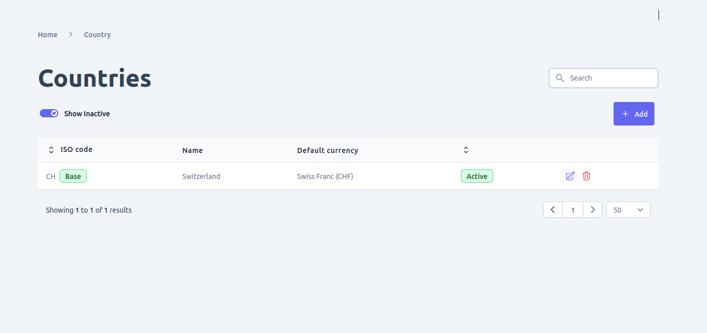
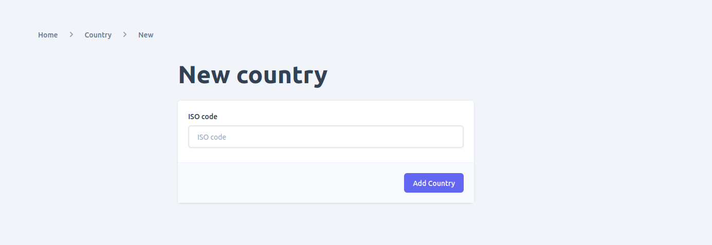
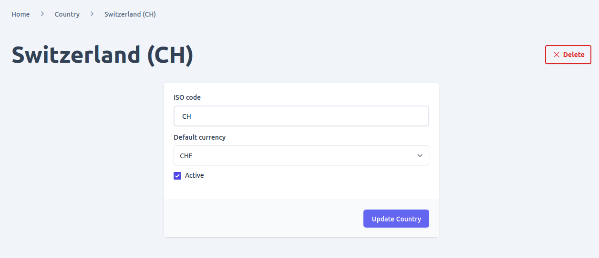

You can add multiple country support to your e-commerce and Admin UI provides a friendly interface for. Once you have added a country and activate it, you will be able to use it on the entire system from product to plugins.

In admin ui you can: 
- View all the countries and search and/or filter them.
- Add new country
- Update existing country
- delete country
- activate or deactivate 

## View supported countries

When you navigate to countries page using the like in navigation, you will see all the currently added countries and which you can filter by there status or search them.

## Add Country
Go to countries page and click on the add button to add new country you want to support in your e-commerce store. You can use the form below to add the countries ISO code and after submitting you will be redirected to the newly added country detail page.

## Update Country

On the countries list, click on the edit icon to view the country detail information or update it. You can change the `status` and `iso code` of a given country. However, it is not recommended to change the iso code because it might have been used on other parts of the system and might cause data integrity issue. So be sure your change doesn't cause integrity issue before updating any of this values.

## Delete Country

You can delete a country in two places either on the list view of countries page or by opening the detail page of a given country. However, be sure your change doesn't cause integrity issue before deleting a country as the operation is not reversible.