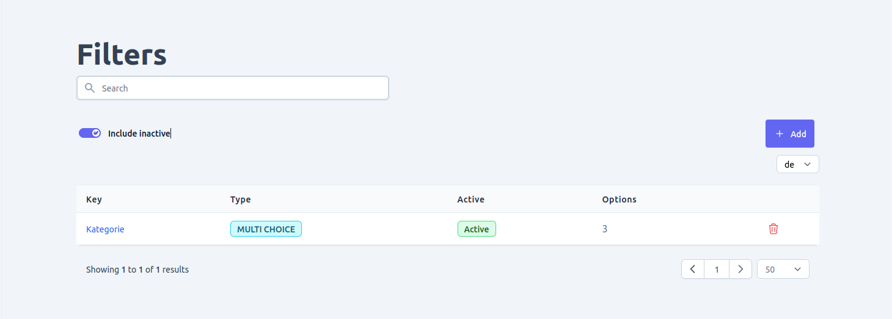
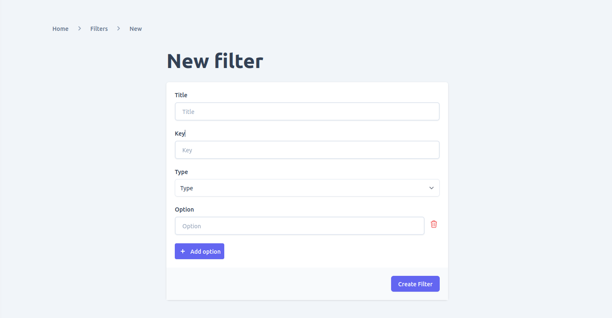
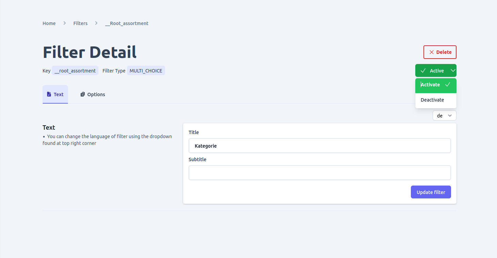
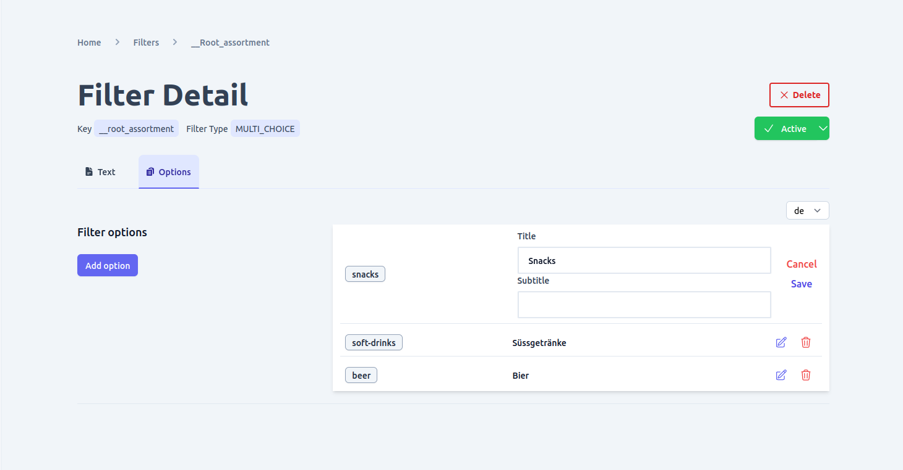
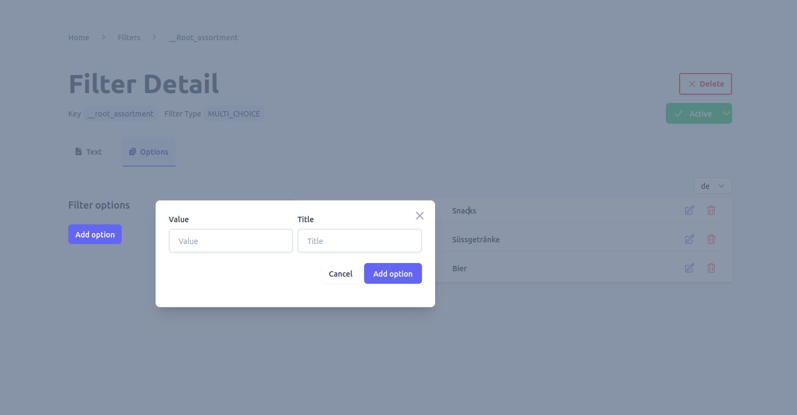

Filters are an essential feature for making products and categories easily accessible on your e-commerce shop. Unchained provides built-in support for defining filters for categories and products, and the admin UI offers a user-friendly interface for managing them.

Some of the actions you can perform using the filter management interface include:
- View existing filters
- Add new filters
- Add filter options
- Update existing filters
- Update filter options
- Delete filters
- Delete filter options
- Activate/deactivate filters

With these capabilities, you can create a customized browsing experience for your customers, making it easier for them to find the products they are looking for.

**Before a filter becomes usable for a category you need to link it by going to the assortment detail page.**
## View filters
By navigating to the "Filters" page in your shop's admin UI, you can view all the filters that currently exist in your shop. You can search and/or filter the filters by various criteria, such as filter name or status, and change the language of the filter.

## Add filter
To add a new filter in your e-commerce shop, go to the filters list page and click on the "add" button. This will present a form where you can input the following details:
- **Title**: The name or title of the filter.
- **Key**: A unique identifier for the filter.
- **Type**: The type of filter you want to create, which can be one of the following:
    - `SWITCH`: A boolean/toggle type filter.
    - `SINGLE_CHOICE`: A filter with options that behave like radio buttons, where only one option can be selected at a time.
    - `MULTIPLE_CHOICE`: A filter with options that can be applied together to filter content.
    - `RANGE`: A filter that allows users to select a range of values, such as a date range filter.
- **Options**: The filter options that will be applied to filter content. Depending on the type of filter, there can be one or multiple options.

## View and edit filter

To view or edit a specific filter, simply click on it from the list on the filters page. From there, you can also add localized titles and subtitles to the filter if your shop is localized. However, to add localized text for a specific language, you must first [add the language](./language/#add-language) by going to the [language page](./language).

## Activate/deactivate filter
To manage the status of a filter, go to the filter detail page and locate the button at the top right corner that displays the current status. This button can be used to toggle the status of a filter between active and inactive, depending on its current status.

Ensuring the proper status of your filters is important for managing your e-commerce shop effectively. Active filters will be available for customers to use when searching for products, while inactive filters will not be visible to customers.

## View and edit filter options
The option tab can be accessed from the filter detail page, and it allows you to make changes to the title and subtitle of a filter option. If your e-commerce shop is set up for multiple languages, you can also add localized text for specific languages to your filter options. Keep in mind that you must first [add the desired language](./language/#add-language) by going to the [language](./language) page before adding localized text.

## Add filter option
To add more options to a filter that has already been created, you can go to the options tab on the filter detail page.

## Delete filter

To delete a filter, there are two options available. The first option is to delete the filter from the list view on the filters page. The second option is to delete the filter from the detail page of the specific filter. However, before deleting a filter, ensure that deleting it won't cause any integrity issues, as the operation is not reversible.