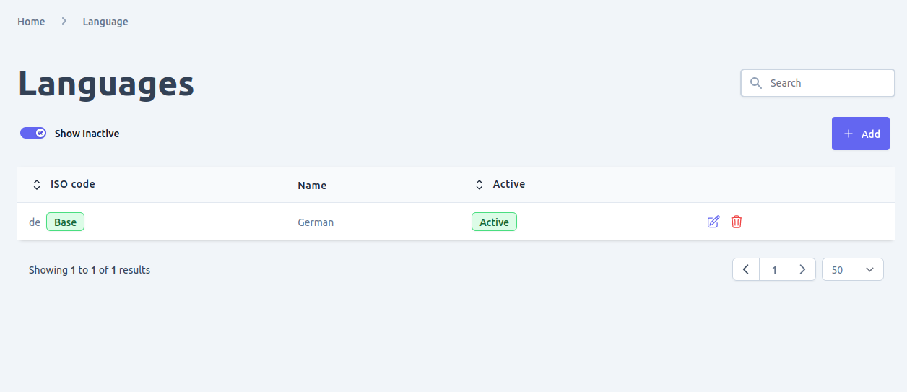
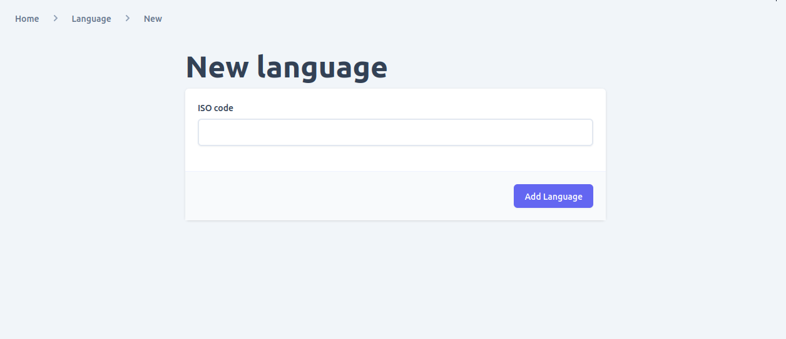
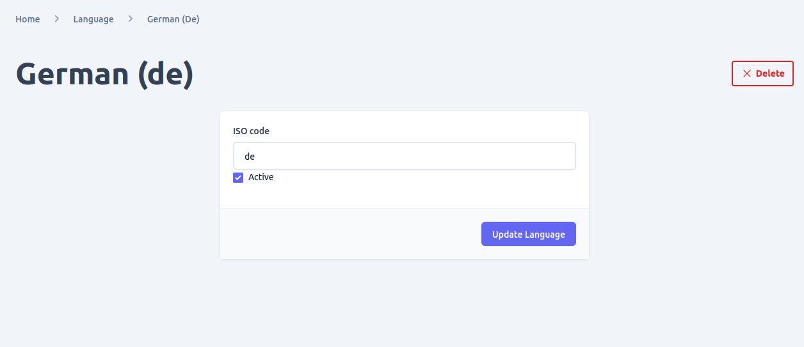

You can add multiple language/locale support to your e-commerce and Admin UI provides a friendly interface for. Once you have added a language and activate it, you will be able to use it on the entire system from product & assortment to filter texts localization.

In admin ui you can: 
- View all the language and search and/or filter them.
- Add new language
- Update existing language
- delete language
- activate or deactivate 

## View supported Language

When you navigate to languages page using the like in navigation, you will see all the currently added languages and which you can filter by there status or search them.

## Add Language
Go to languages page and click on the add button to add new language you want to support in your e-commerce store. You can use the form below to add the language ISO code and after submitting you will be redirected to the newly added language detail page.

## Update Language

On the languages list, click on the edit icon to view the language detail information or update it. You can change the `status` and `iso code` of a given language. However, it is not recommended to change the iso code because it might have been used on other parts of the system and might cause data integrity issue. So be sure your change doesn't cause integrity issue before updating any of this values.

## Delete Language

You can delete a language in two places either on the list view of languages page or by opening the detail page of a given language. However, be sure your change doesn't cause integrity issue before deleting a language as the operation is not reversible.