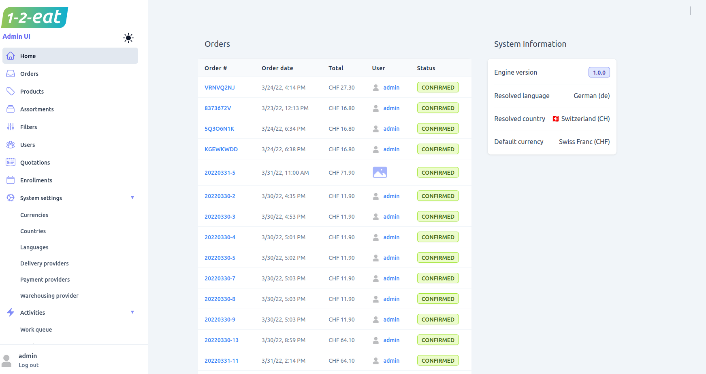

The Admin UI is has been designed to provide an intuitive and user-friendly interface that makes it easy for merchants to perform their day-to-day tasks. Merchants can use the Admin UI to manage products, categories, orders, customers, promotions, and more stored in unchained engine. 

 Unchained Commerce Admin UI is a powerful tool that provides merchants with the ability to efficiently manage their online store, streamline workflows, and create a seamless shopping experience for their customers

