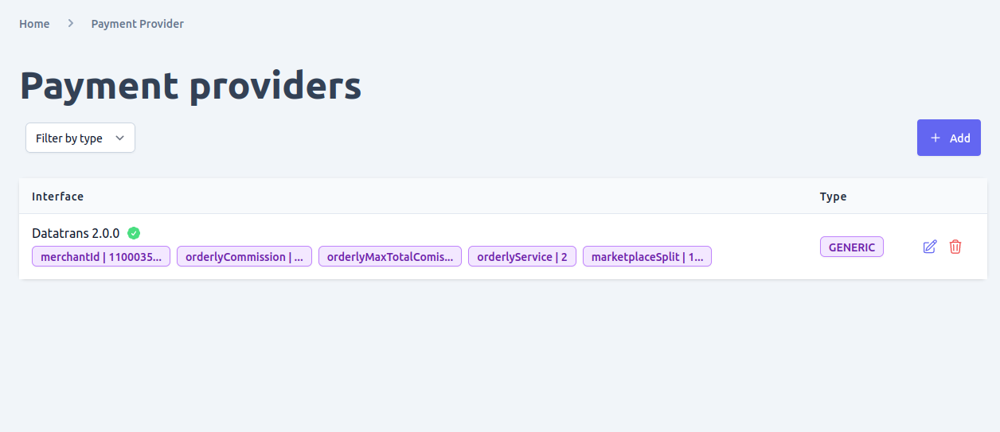
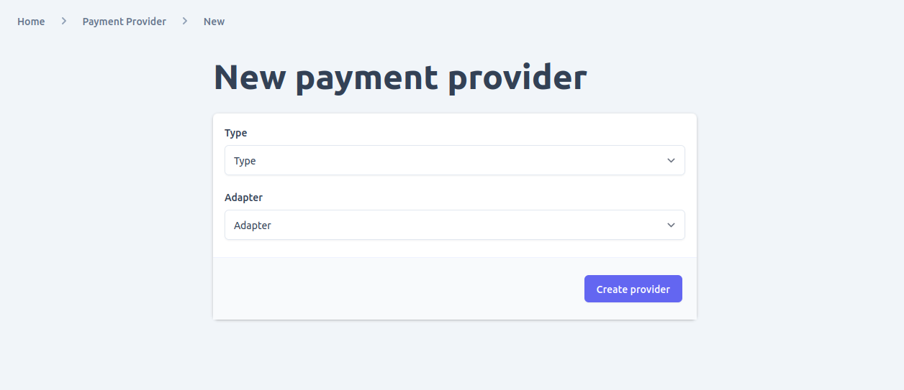
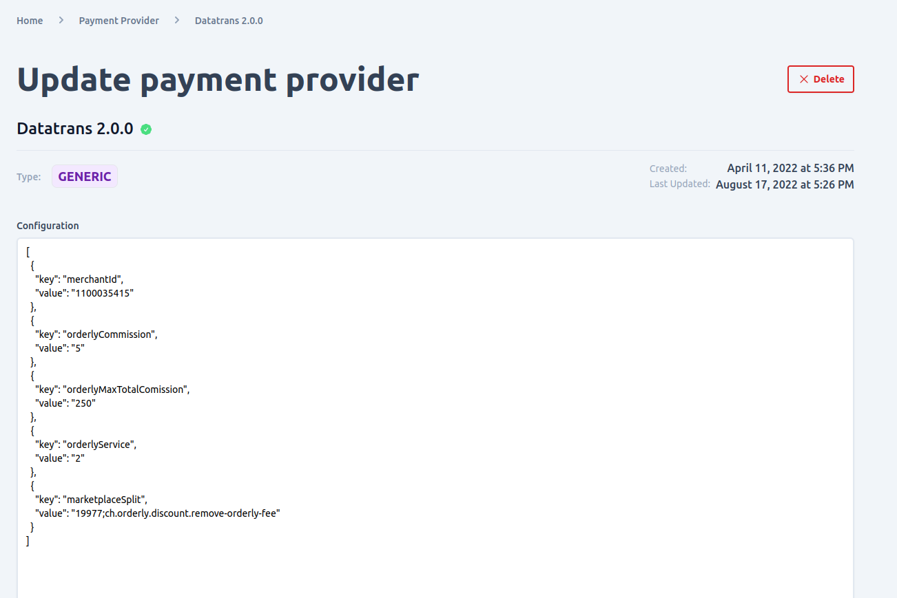

You can manage payment providers supported in your shop by navigating to payment provider page **system settings > payment providers**

Admin UI supports all the functionalities needed to manage all the configured payment plugins in unchained such as:
- View and filter
- Add new payment provider
- update existing payment provider
- Delete payment provider

**Note that in order for you to add a payment provider it must be configured and loaded to your shops unchained engine instance before you can manage it using admin UI. Additionally activating and deactivating payment providers is controlled by the plugin logic.**

## View and Filter payment providers
You can view and filter payment providers in added to your shop by type.

## Add new payment providers
You can add new payment provider plugin configured in your system by clicking the add button found in the payment providers list.
On the new payment provider form you will be provided with a form where you can enter the type and adapter for your payment provider. In this case adapter is the paymentProvider adapter plugin configured and loaded in the engine. 

once successfully submitting the form you will be redirected to the newly created payment provider detail page. 

## Update payment providers
By clicking the edit icon of a particular payment provider found on the payment provider list view you can edit some part of the payment provider, manly the `configuration`.  if there is any configuration error on the payment provider you will see a red **x** check mark on the configuration error with any helpful error text.

## Delete payment providers

You can delete a payment providers in two places either on the list view of payment provider page or by opening the detail page of a given payment provider. However, be sure your change doesn't cause integrity issue before deleting a currency as the operation is not reversible.