Products are the integral part of any e-commerce shop and Unchained engine provides multiple product types to suit your needs. On the unchained Admin Ui you can mange all your shop products with an intuitive interface and perform tasks suc as:
- Add new product
- Edit product information and Add localized variation of a product information or delete exiting product
- Add media's to a product
- Price a product
- Add token information of a token product type (more detail on this can be found below)
- Create a bundle product
- Add product variation
- Add subscription plan configuration to a product
- Activate deactivate
- View and/or search and/filter product

## Overview
Before we talk about all the product configuration capabilities available in unchained lets first have an overview of the different type of products supported in unchained.

Unchained Engine is a powerful e-commerce platform that enables merchants to create and manage their online stores with ease. It provides a range of features and functionalities that help merchants to sell their products online, such as inventory management, order processing, payment processing, and more. Here are the various types of products that Unchained Engine supports:

1. **SimpleProduct**: A simple product is a standard product with a fixed price and no variations or customization options. This type of product is suitable for merchants who sell standard, one-size-fits-all products that don't require any additional options or configurations. Examples of simple products include a single book or a basic t-shirt.

**Use case**: A clothing store might sell a basic t-shirt as a simple product. The product would have a fixed price and no variations or customization options. Customers would simply choose their size and color, add the item to their cart, and check out.

2. **TokenizedProduct**:A tokenized product is a digital product that is stored on a blockchain network and can be traded as a token. This type of product is useful for merchants who want to sell digital assets [NFT](https://ethereum.org/en/nft/) such as digital art or music in a secure and decentralized way.

**Use case**: An online marketplace for digital art might sell tokenized products that represent ownership of a specific piece of art. Customers would purchase the token and receive ownership of the artwork on the blockchain network. The artwork could then be traded or sold by the customer on the blockchain network.

**Use case**: An online marketplace for digital art might sell tokenized products that represent ownership of a specific piece of art. Customers would purchase the token and receive ownership of the artwork on the blockchain network. The artwork could then be traded or sold by the customer on the blockchain network.

3. **PlanProduct**: A plan product is a subscription-based product that customers pay for on a recurring basis. This type of product is useful for merchants who offer ongoing services or products that require regular replenishment. Examples of plan products include a monthly subscription to a meal delivery service or a quarterly subscription to a magazine.

**Use case**: A meal delivery service might offer a plan product that provides customers with a certain number of meals each week. Customers would sign up for the plan and receive their meals on a recurring basis. The merchant would automatically bill the customer for the plan each month until they cancel.

4. **BundleProduct**: A bundle product is a collection of simple products that are sold as a package. This type of product is useful for merchants who want to sell related products together or provide customers with a discount for purchasing multiple products at once. Examples of bundle products include a set of kitchen utensils or a collection of books.

**Use case**: A bookstore might sell a bundle product that includes multiple books in a specific genre or by a specific author. The bundle would have a discounted price compared to buying each book separately. Customers would add the bundle to their cart and receive all the books in the bundle when they check out.

5. **ConfigurableProduct**: A configurable product is a product that has multiple options or configurations. This type of product is useful for merchants who sell products with variations or customization options, such as clothing with different sizes and colors or laptops with different specifications.

**Use case**: A clothing store might sell a configurable product that allows customers to choose the size, color, and style of a shirt. The price of the shirt would vary based on the selected options. Customers would choose their options, see the updated price, and add the item to their cart.

## View and filter and/or search products
On the products list view page you can browse all the products oin your e-commerce site. You can narrow the scope of products displayed using any of the filter options such as tags and/or status or searching for a specific product.
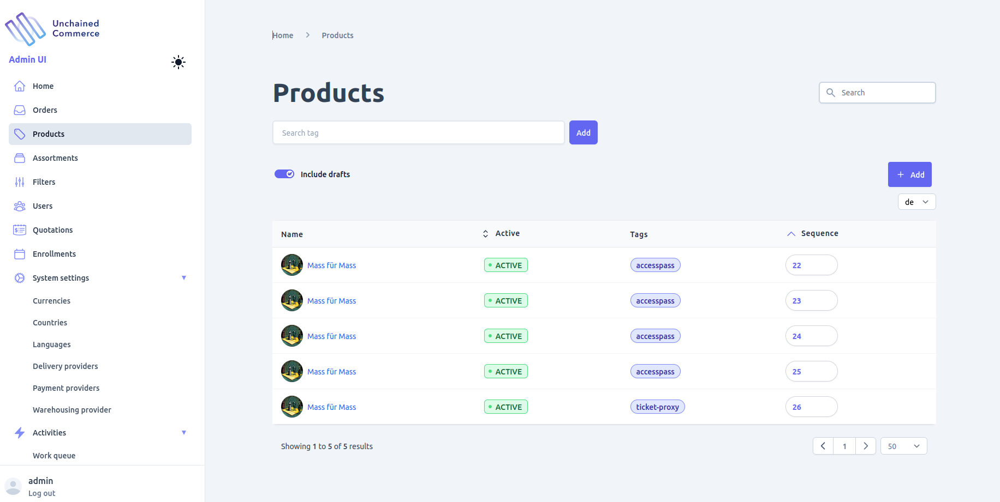

## Add product
You can adding a product to your shop by clicking on the **Add** button found on the product list view where you will be presented with a form similar to the one below. 
In order to create a product you should provide the product title and it's type where type is any of the supported type that the product you are selling in your shop list above.

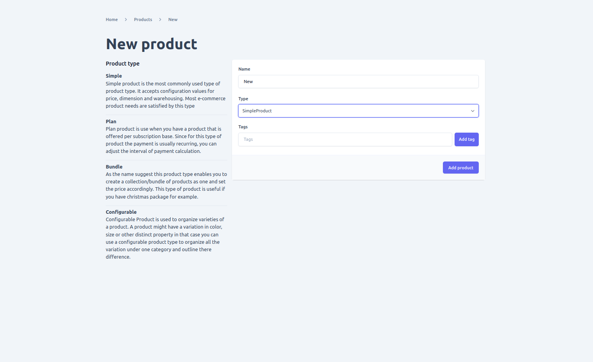

## Edit Product
After opening detail view of a product You can update a lot of information of a product based on it's type

### Global update options
Below are updatable options found on every product type
1. **texts**: On this tab you are able to update all the text data of a product including title, subtitle and description etc... Additionally you can also add a localized text to all of the supported language in your shop by selecting the language you want at the top right of the form. 

**Note: In order to add a localized text you first need to add the language on using the [new language form](./language/#add-language).**

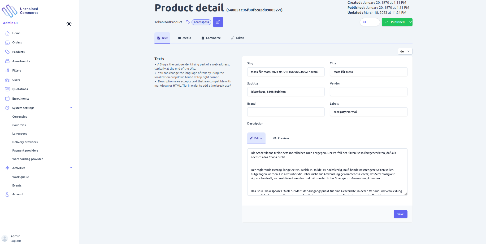

2. **Media**: On many you want to attach a media file to a product to to convey additional information about the product and/or make the shop user interface friendly. By going to the media tab found on product detail page you can manage media files of a product of a product such as adding, updating or deleting. Additionally you can also add a localized text to all of the supported language in your shop by selecting the language you want at the top right of the form. 
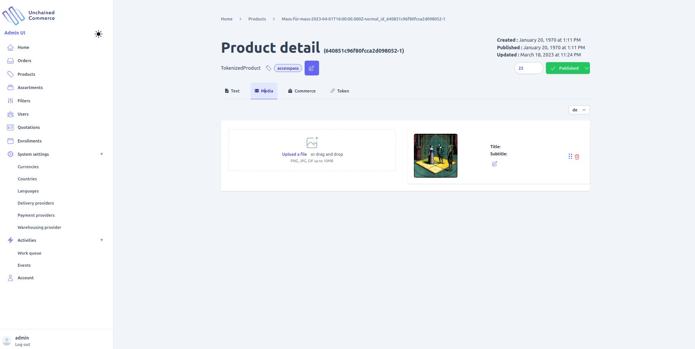

3. **Tags**: Tags are useful when you want to add additional information of a product that distinguishes it from other for example. you can add or remove tags to a product by clicking on the tag button found at the top of the page.

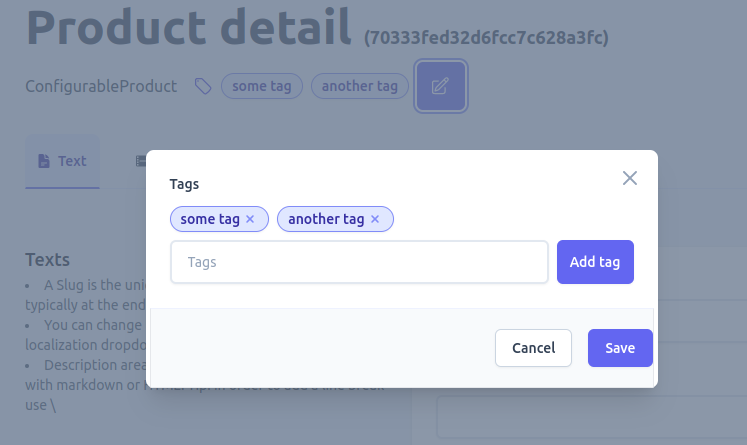

4. **Sequence**: You can change the sort order for a product by changing its sequence where a product with the smallest sequence will be returned first

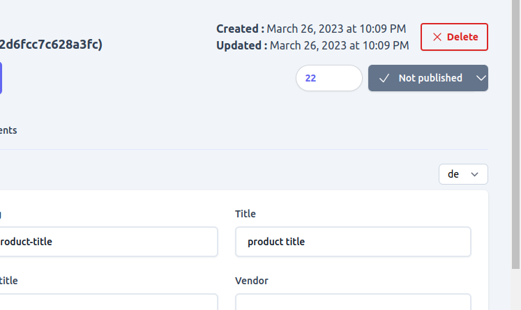

5. **Status**: By default only active products are returned and all the operations are also performed on a product when it's active. However if you don't want to remove a product from your shop but also don't want to display it to customers for any reason you can change it's status to draft.
Toggling a product status is as easy as toggling the button showing current status of a product and selecting a status.

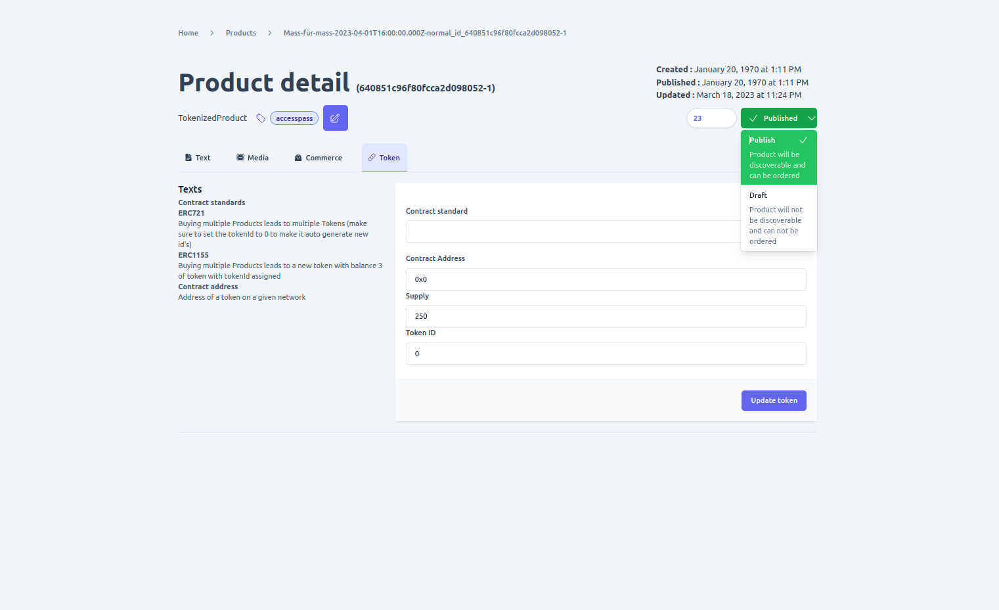

6. **Delete**: You can remove a product by clicking on the delete button available on a product detail page. a product is deletable only when it is in a **DRAFT** state, so if you want to delete a product that is active change its status to do so.

**Note: be sure your change doesn't cause integrity issue and that the removal of the product does not affect operation of the shop such as active orders before deleting as the operation is not reversible.**

### Scoped update options
Based on the product type there are additional configuration options available for a product. Below are all the available options for each product type

1. **Price or Commerce**

**Applicable to products with type**
- Simple
- Tokenized
- Bundle
- Plan /subscription

Since its a shop every product has a price and you can add one or multiple prices to a given product using the commerce tab available on the product detail page. 
on the product commerce form you will be required to provide the following information
- **Max Quantity**:- refers to the maximum number of product that should be in an order for the price to be used for a product. if left empty or 0 then it will be used as the default price for a product unless there is another price entry with max quantity set. On that case that price will be used the number of products in a order satisfy it.
- **Price**:- Actual price  of the product. Note decimal pricing is not supported to you should enter price for a product by multiplying it with 100. for example if a product price is $35 then entry on the price field should be 3500 and if the price is $3.5 it should be entered as 350.
- **Vat suspect**:- determines if tax should be added on the product price when calculating total price of a product. the applied tax can be different based on the ProductPricing plugin in configured on the engine.
- **Net price**:- Determines wether the price is final or tax, discount, delivery and other additional costs should be added to it when calculating total price
- **Country**:- if you have different price for a product based on the customers order location you can select the country where a given price is applicable using this field.
In order to add a select a country for a price you need to add the country in question using the  [new country form](./country/#add-country) first.
- **Currency**:- Currency of the price. you can have multiple currency prices configured for a product and based on the order currency the corresponding price will be applied.
In order to add a select a currency for a price you need to add the currency using the  [new currency form](./currency/#add-new-currency) first.

**Requirements of pricing**
- There must be one price entry with max quantity set to 0 that can be used as the default price.
- It is not possible to add multiple product price with the same max quantity, country and currency and it will create a conflict.

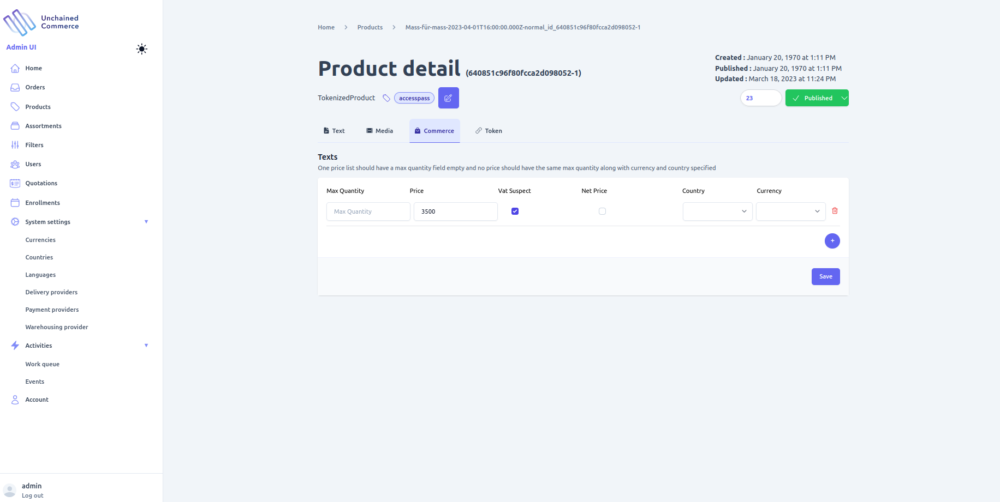

### Specialized configuration options

Below are configuration options available only for a specific product type.

1. **Supply**

Available on **SimpleProduct**

Because Simple product is standard physical you may need to provide additional information that outlines the dimensions of a product. by navigating to the `supply` tab found on a product detail page You can add dimensions related information such as weight, length, width and height of a product.

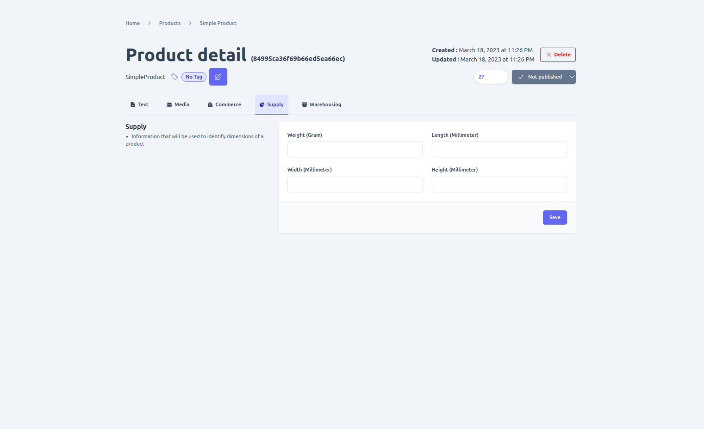

2. **Warehousing**

Available on **SimpleProduct**

Physical or Simple product are stored in some type of warehouse and using the `warehousing` tab found on a product detail page you can add storage information such as **SKU** code and **Base unit** of measure.

3. **Bundles**

Available on **BundleProduct**

Bundle products are products available on a shop as a group and you can mange a bundle product bundles by navigating to the `Bundles` tab available on a product detail page.

You can add and remove on or many products as a bundle along with the quantity assigned for the bundle using the form provided

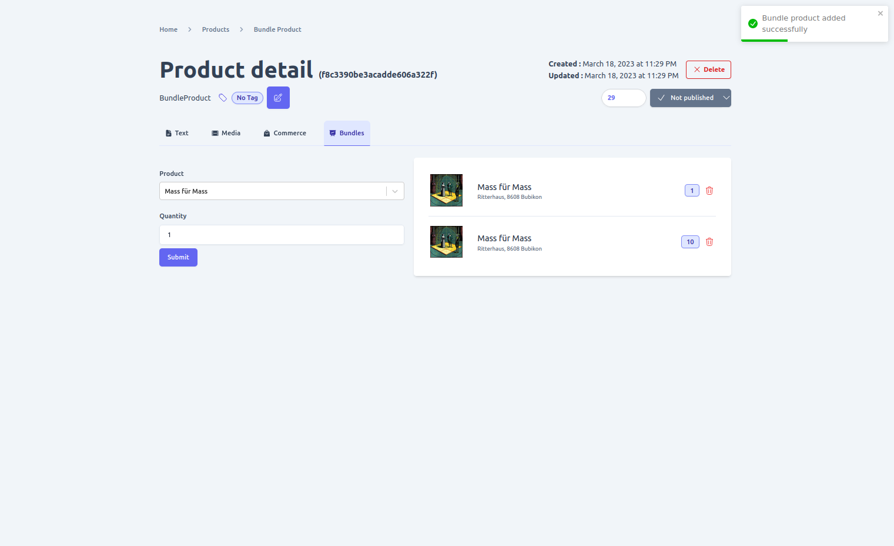

4. **Variation**

Available on **ConfigurableProduct**

Configurable product is a grouping of similar products with different characteristic and you can add all the different variation of a product you want to sell in your shop using the `variations` tab found on the product detail page.
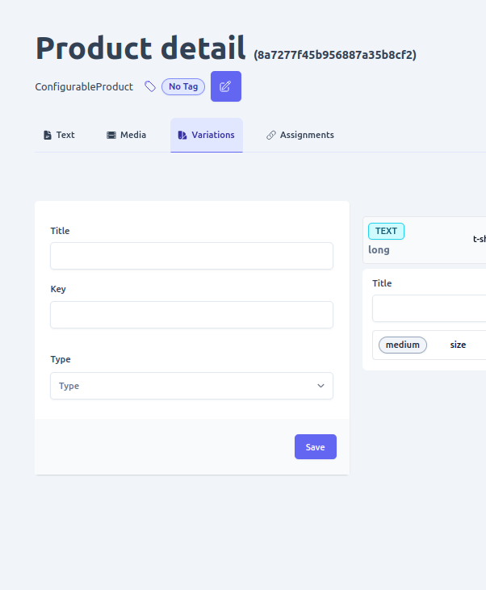

- **Adding variation option**

Variation is the top level category of differentiation for example if you are selling laptop on your shop and there are various brand of laptops available brand of the laptop say HP can be the top level title of variation. 

However to add the actual differentiating factor of a configurable product  you need to create the variation option using the form provided under the `variations` tab of a product detail page. Continuing with the above example if you have different rams of HP laptops you create a variation option for each type.
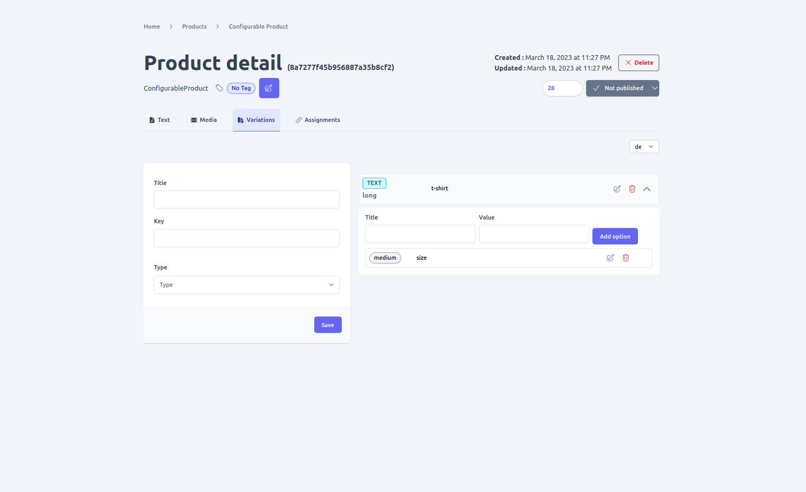

5. **Assignments**

Available on **ConfigurableProduct**

After creating variation and variation options of a configurable product the next step is assigning the actual product that satisfies the variation configuration. You can manage assigns of a product for each variation option by using the `assignments` tab found the product detail page.

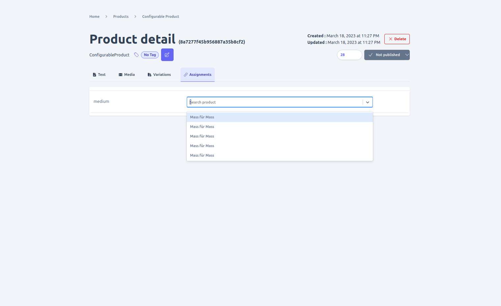

6. **Token**

Available on **TokenizedProduct**

Since Tokenized product is a digital asset there are unique information specific to digital assets you should add that defines the token. 
such as:
- **Contract Standard**:- Token standard used to create the digital asset.
- **Contract address**:- Address of the token on the blockchain it is found 
- **Supply**:- Total tokens in circulation 
- **Token Id**:- Unique identifier of the token

**Based on the contract standard of the token implementation some fields might be optional**

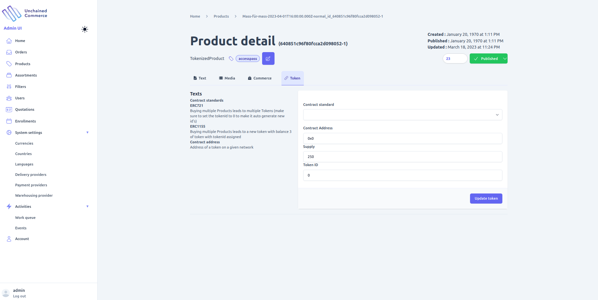