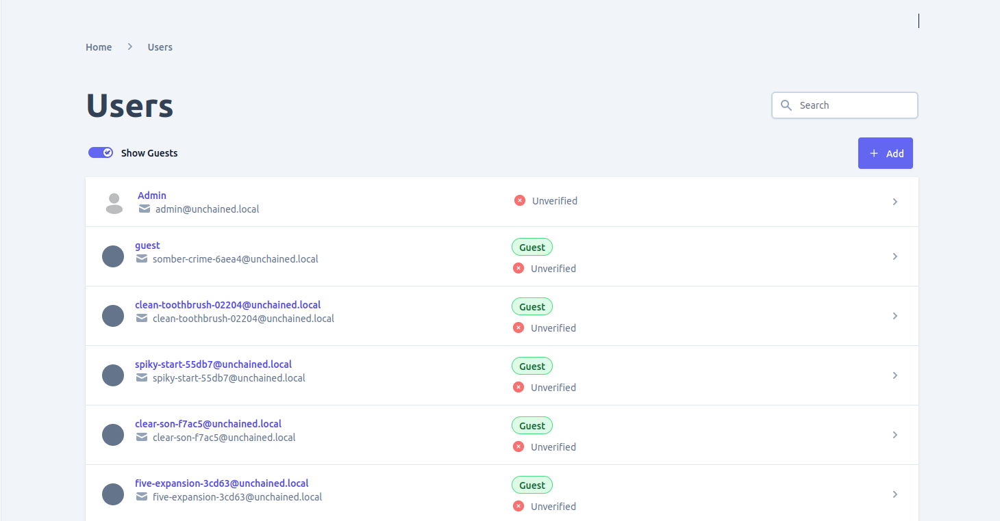
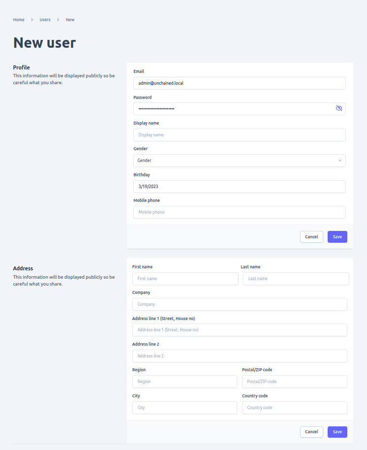
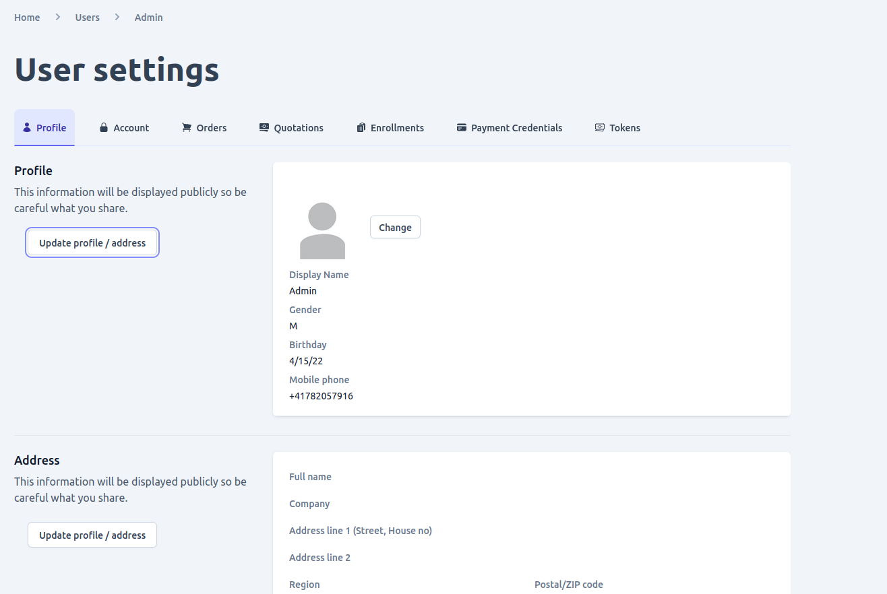
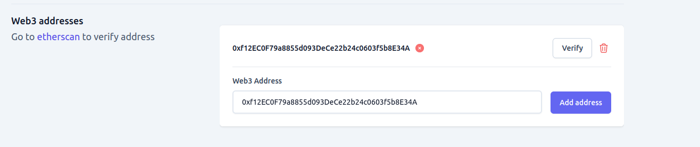
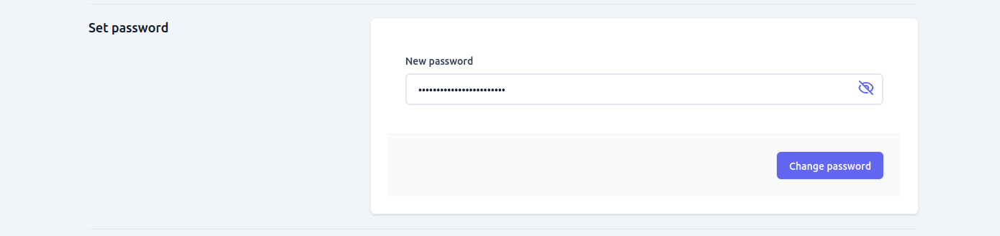
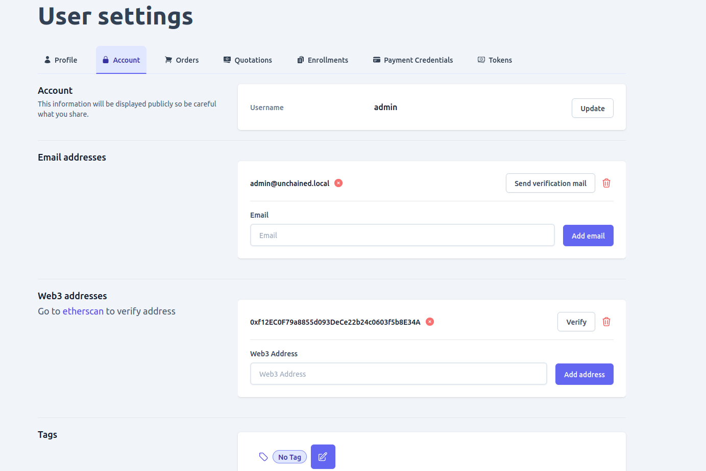
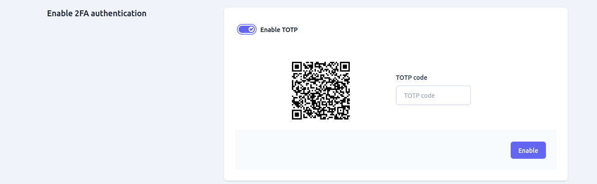

Customer information is a critical part of an e-commerce site and admin ui gives you a comprehensive interface that lets you view and/or manage user data based on your access right.
By default every user that is logged  in can mange the account there own account but a special role such as and admin or a custom configured role is needed if you want to view and manage 
other users data.

There are two types of users in admin UI, Guest and non-guest or registered. Guest user is created when you use `loginAsGuest` API to login in. this is beneficial when you want to enables unregistered customer in your shop to still be able to utilize adding to cart and/or bookmark a product without registering. But when a user finally decides to checkout and order they will need to register to complete the process.

If you have the right privlage to view and/or manage other users information including guest you can do so by navigating to **Users** page. where you can 
- View all the users in the shop with filter and search capability
- Add new User
- View detail user information such as (profile info, orders, quotations, subscriptions and payment credentials)
- Edit user profile information
- delete user
- view all the orders made by a user
- view all the quotations made by a user
- view all the subscriptions made by a user
- view all the payment credentials of a user

## View all Users
After navigating to Users page you will be presented an intuitive user interface where you:
- Filter and/or search users

## Add new user
On the list view there is an **Add** button which you can use to add a new user in your shop if you have the access right to do so. you will be presented with a form similar to the one below. after adding a user successfully you will be redirected to the newly added user detail page where you can view and/or edit additional information such profile picture, additional email and more.

##  View and/or edit user detail
When you open a user from a list you will be redirected to a user detail page when you will be able to view details of that particular user listed below

1. ### Profile information of a user
on this tab information such as name, address, birthday and other personal information of a user is displayed and if you have the rights you can also edit them using the edit button available

2. ### Account information of a user
On this tab all the below information of the user accounts are displayed and can be edited if you have the rights to do so.
    - Email addresses:- Editable list of email addresses linked with the user
    - Web3 addresses:- list of editable blockchain addresses linked with a user account
    - Tags:- Editable list of tags
    
    - Roles:- roles of the user
    - Password change form:- Used to change the current password for that particular user in addition by default a user with **Admin** role but it can be another custom configured role can change the password of any user using the set-password form visible to only an account with a special permission
    

    - 2FA authentication:- Used to activate or deactivate [TOTP/Time based one time password](https://en.wikipedia.org/wiki/Time-based_one-time_password) authentication of a user
    - Web Authn:- Used to view devices to used for [Web authn](https://webauthn.guide/) authentication method

    

    

3. ### Additional information of a user
In addition to the above setting related information you can also view and search data of a user such as Order, Quotations, Subscriptions and Payment credentials using the tab.