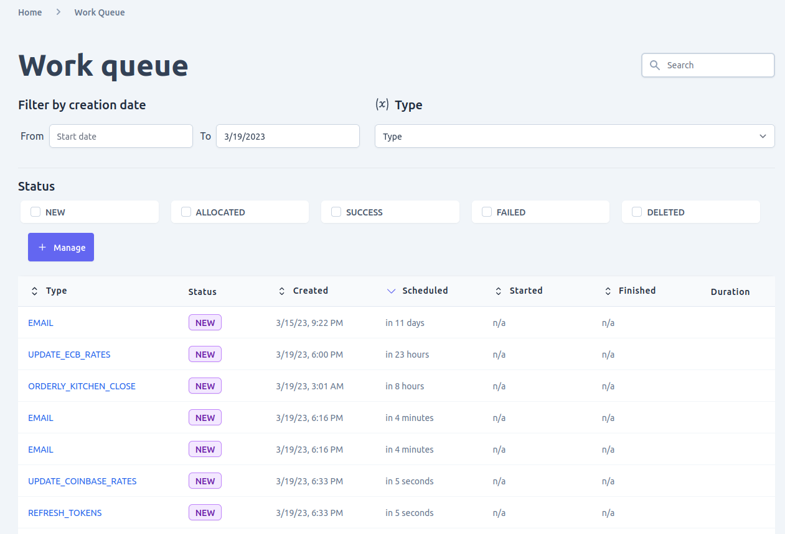
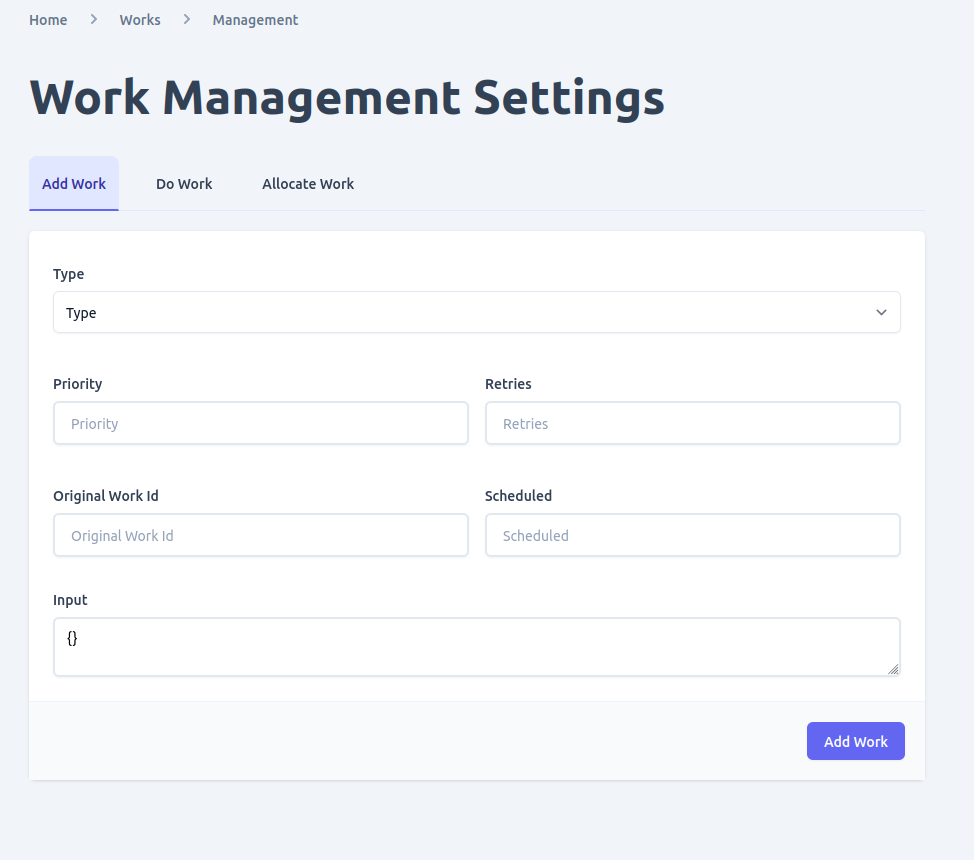
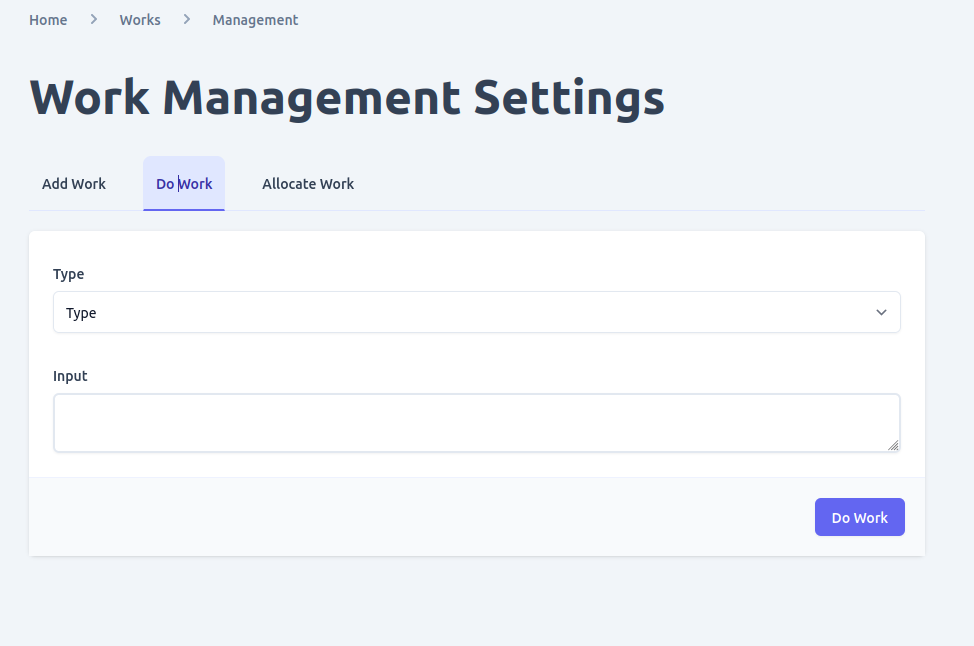
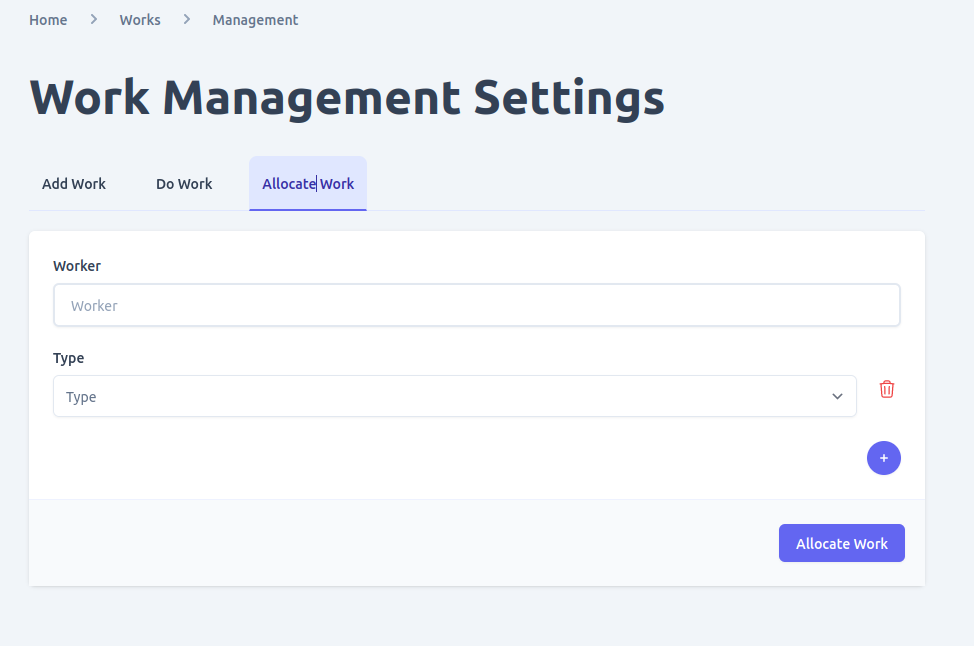
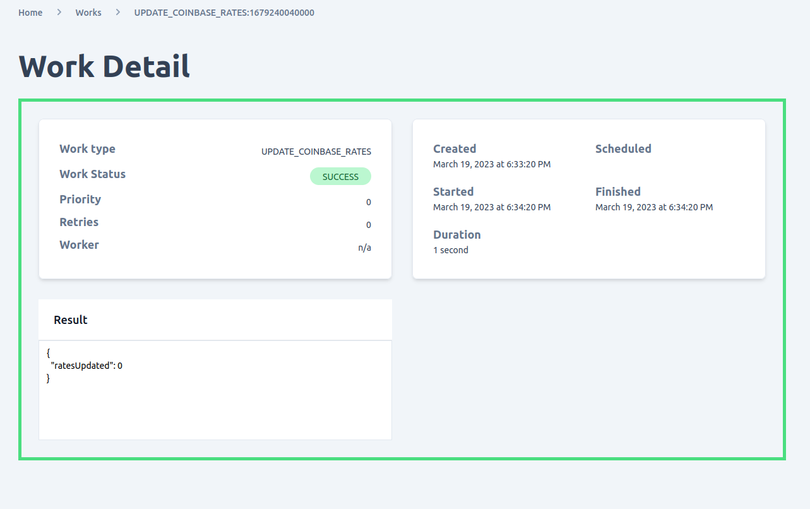

Unchained engine utilizes a worker module to perform various task related with a shops operation. you can manage workers configured in the engine using admin ui and perform tasks such as
- View and filter work queue
- Add work
- Do work
- allocate work
- delete work 

## View work queue
You can view all the active and complete workers in the engine by navigating to **activities > work queue**. In this page you are able to search and/or filter the work queue using different methods such as
- work start and and date
- worker type
- worker status

## Add work
You can add work to the work queue by clicking on the **manage** button found in the work list page. in order to add a worker the Worker adapter must be configured in the engine and activated. 
Add work provides fields for you to select the Worker **type** and any optional additional information you want to pass to the worker and worker module such as
- `priority` where anything closer to 0 including 0 is given high priority over other workers with larger priority
- `retries` determines how many time a worker should be retried by the worker module in case of an error attempts
- `original work id` only applicable if you want to use a previously run worker. in which case you provide the worker id
- `scheduled`defines when to run the worker. if left `undefined` it will be run to the closes time possible.
- `input` is data that should be passed to the worker based on the configuration

when adding a new worker it will have a status of **New** automatically

## Do work
You can also use a previously run worker to work new job for you by using the do work option. in this case you will only need to provide the worker in question and any input parameter it might expect and the worker will be added to the work queue automatically.

## Allocate work

