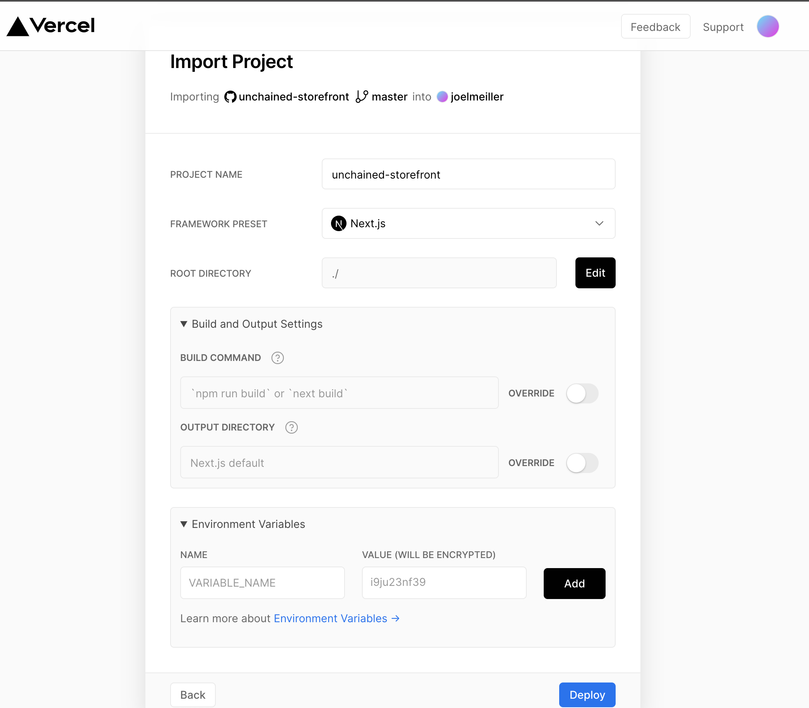

> In this section we will walk through on how to deploy your **Storefront** web app to [Vercel](https://vercel.com/)

This tutorial helps you:

- Deploy your web shop
- Publish the shop under your domain (or subdomain)

Make sure you have successfully completed the [Setup Shop](/getting-started-shop) guide.

## Step 1: Building the app

Before deploying we make sure our app bundles correctly by initiating a production build locally.
Navigate to the **Storefront** project and run the build command.

```bash
cd my-storefront-webapp

npm run build
```

This might take a moment. Once successful push everything to your git-repository.

```bash
git add .
git commit -m 'build version for deploy'
git push
```

If working on a specific branch, merge the branch into your **master** (or **main**) branch before continuing.

## Step 2: Connect the git with Vercel account

Create a Vercal account [here](https://vercel.com/signup). Once logged in you should see the setup window for your initial project.

You will need to allow Vercel to access your git repository. Once the repository is connected you should end up in the following screen:



## Step 3: Setup and run the deployment

Vercel detects automatically that your project is a Next.js app and will the build and deploy settings for you. No action required. 😎

However, we need to set some few **Environment Variables**.

| NAME                   | VALUE                                          |
| ---------------------- | ---------------------------------------------- |
| **UNCHAINED_ENDPOINT** |  https://your-unchained-instance.rocks/graphql |
| _Optional_             |                                                |       
| FRONTEND_URL           |  https://domain-of-your-frontend               |
| GRAPHQL_ENDPOINT       |  https://domain-of-your-frontend/api/graphql   |


