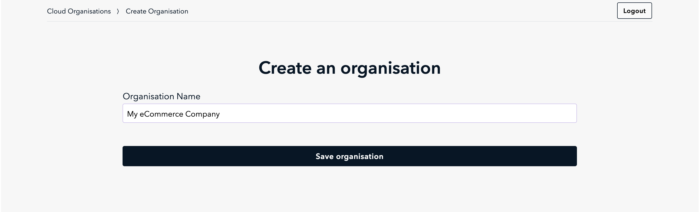
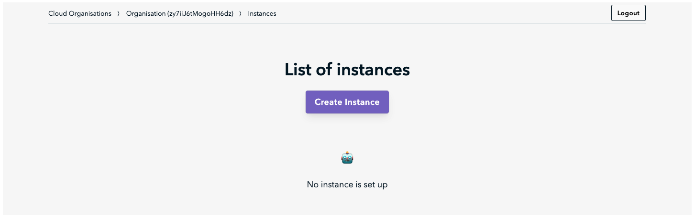
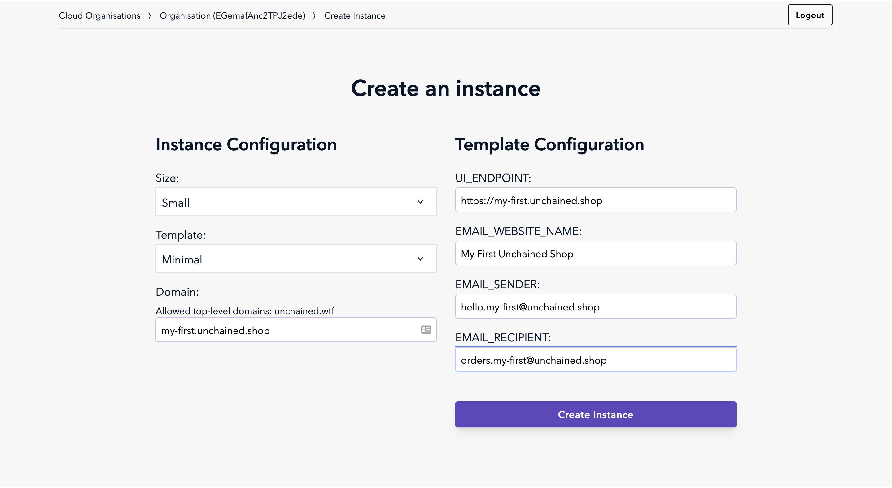
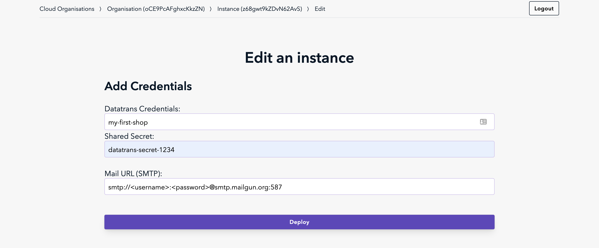
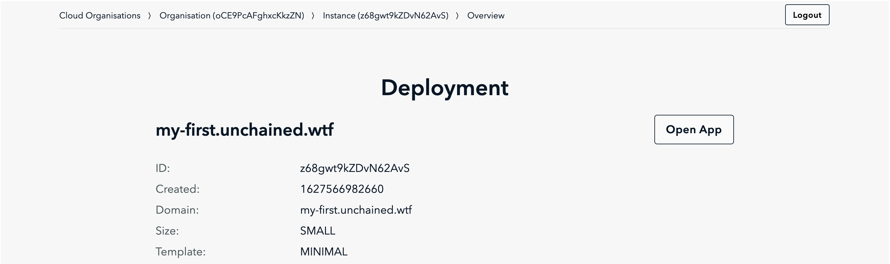
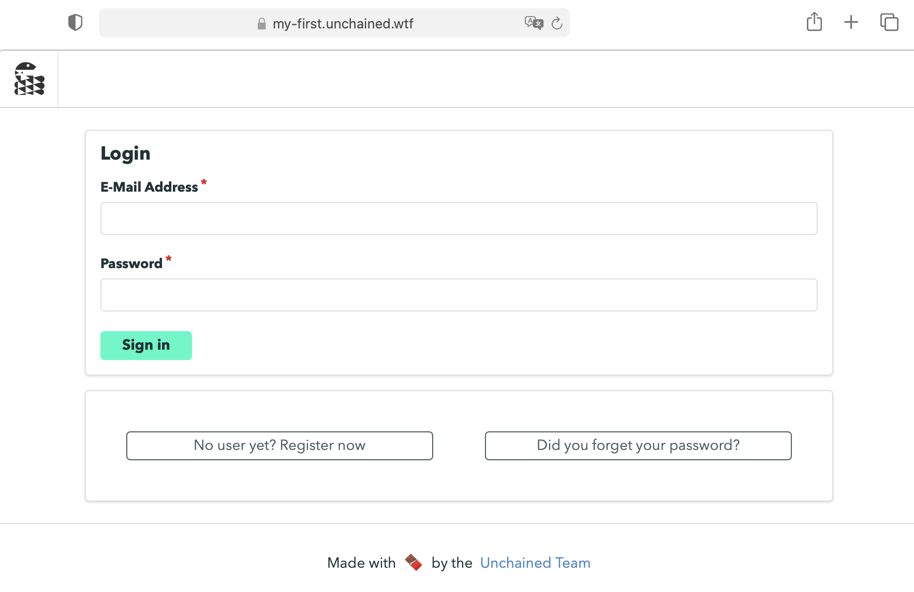

> This chapter explains how to launch your own Unchained Engine instance on our Unchained hosted service.

This tutorial helps you:

- Setup a hosted Unchained Engine
- Access the engine's control panel

## Step 1: Sign-up for an Unchained account

In order to get a cloud-hosted unchained instance, you need to [sign up](https://unchained.shop/en/signup) and request a 14-day trial.

## Step 2: Create a new Instance 

1. After registration you will be redirected to the create organization page.
Create one by entering your organization's name and click **Save organisation**.

2. The Instance List page is shown. Click on **Create instance** to proceed.

3. Provide the information required to create the new engine instance. The following diagram provides an overview of what you should enter in order to successfully create the instance. 

**IMPORTANT** Use <u>unchained.shop</u> for all domain and email settings (e.g. my-name.unchained.shop, my-name@unchained.shop).
4. In next screen simple ignore the datatrans block. Payment sources can be created using the control panel. Add some values to the fields in order to proceed.
More importantly set URL to your SMTP server in order to send and receive mails.

5. If all went well you will see the instance summary page after a few seconds.
 

## Step 3: Verify engine
1. Click on **Open App** in the instance summary page to navigate to the Control Panel under your engine's domain.
2. The URL looks something like <u>my-shop-name.unchained.shop/signup</u>
3. You should see the login window of the Control Panel. 
 

Congratulations! 👏🏻 Your Unchained Engine is up and running!
