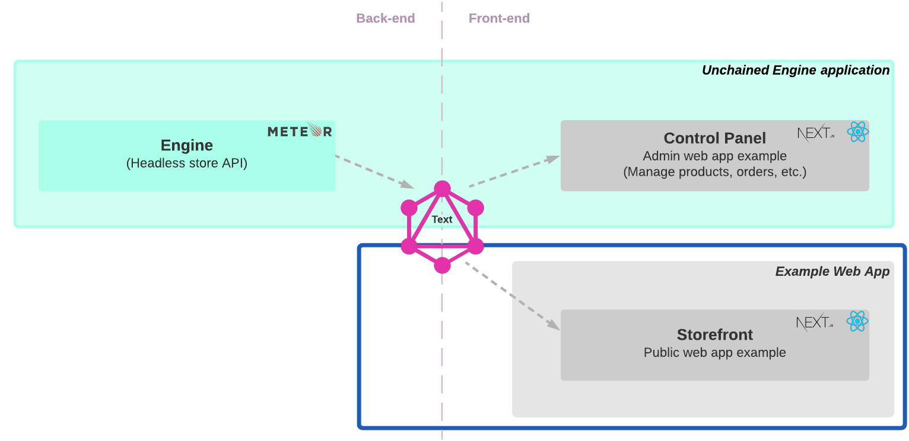

> To test the Unchained Engine we setup Unchained's test storefront project created with [Next.js](https://nextjs.org/) and [React.js](https://reactjs.org/) locally.



This tutorial helps you:

- Install the storefront web app locally
- Conntect to the hosted Unchained Engine via [graphQL](https://graphql.org/)

## Prerequisites

The storefront installation requires a Node version > 14.
```bash
node --version
v14.17.1
```

## Step 1: Installation

The **Storefront** project is a [Next.js](https://nextjs.org/) based web app and connects to your Unchained Engine through [graphQL](https://graphql.org/) queries.

1. First create a new folder for your project to be installed.
```bash
mkdir my-storefront-webapp
cd my-storefront-webapp
```
2. Use the Unchained initialisation script to download the code.
```bash
npm init @unchainedshop
```
3. A message prompts you to select the installation template. Choose **storefront** by using the `down key` and press `enter` 
```bash
? What type of template do you want › 
Full stack e-commerce
Storefront <--
Unchained engine
```
4. Next two steps are to select the directory, as we already created a new empty directory you can simply press `enter`, and whether you want to initialise git which is up to you.
```bash
? Directory name relative to current directory 
 (press Enter to use current directory) › 
? Do you want Initialize git? no / yes
```
5. Install the npm packages
```bash
npm install
```

## Step 2: Setup connection

Before running the web app, you need to create an `.env` file in the root directory of _my-storefront-webapp_ and add the graphql API endpoint of your Unchained Engine instance to the settings.

You retrieve the URL for the endpoint after successful creation of the Unchained Engine instance in [Step 1 - Launch Engine](/getting-started/engine-launch). Append it with the `graphql` path.

```
UNCHAINED_ENDPOINT=https://my-first.unchained.shop/graphql
```

Check the [Install engine](/installation/install-engine) guide to create and connect to your local instance of the Unchained Engine.

## Step 3: Start the app

Now, start the app by using the following command.

```bash
npm run dev
```

Open [localhost:3000](http://localhost:3000) to check your storefront webapp is running correctly.

And that's it! Your storefront is now running locally.


