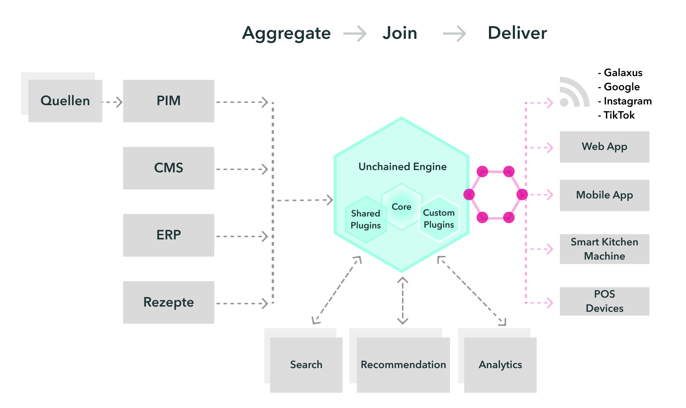
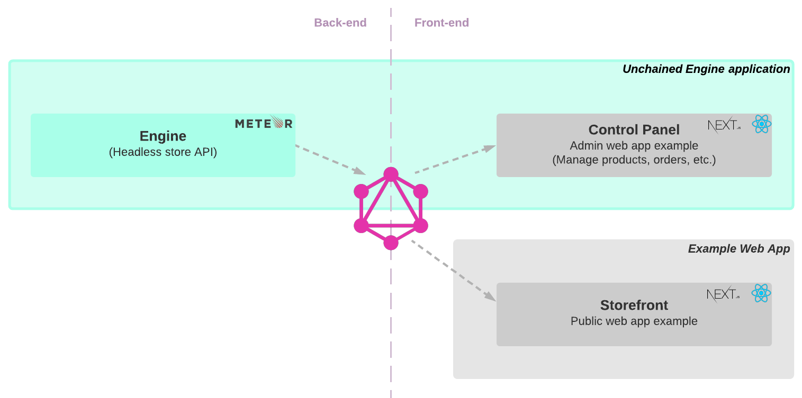

**Unchained Engine is an open-source API-first e-commerce framework that lets you build your own custom shopping experiences**

#### Unchained Engine provides:

- **Codeability**, so you can tweak the system with endless possibilities not restricted by "customization" or a settings-approach
- **GraphQL API**, allowing you to build fast, performant and modern storefronts
- **Stateless architecture**, allowing you to scale horizontally and vertically
- **Production readiness**, due the fact that the host company uses the Unchained Engine for medium- to big enterprise web shops (Dogfooding)

### Solution Overview

The following diagram shows all applications and services provided by Unchained as open-source software for you to easily setup your first eCommerce store in a few minutes.

As you can see the Unchained Engine ecosystem consists of

- the **Engine** itself as server-side only graphQL API included in an [Meteor](https://www.meteor.com/) app to serve all functionality to manage the store \*
- the **Control Panel** which provides a UI to manage the store's users, products, orders and more as [Next.js](https://nextjs.org/) app \*
- the **storefront** boilerplate web app which provides a customizable UI for the public store itself as [Next.js](https://nextjs.org/) project

\* The **Unchained Engine** and the **Control Panel** are part of Unchained's hosted service. The [Getting Started](/getting-started/engine-launch) chapter helps you setup a eCommerce solution using the hosted engine service.

#### Ready to try it out?

Let's go. Choose what you want to do first and we guide you trough the Unchained Engine setup

import { Button } from '@apollo/space-kit/Button'
import { Card } from '@apollo/space-kit/Card'
import { Link } from 'gatsby'

 <Card
    style={{ marginTop: 48 }}
    heading="I want to have my eCommerce store online in 15min!"
    description="Quick start tutorial to guide you through the steps to launch our storefront web app online with its own unchained engine setup."
    actions={
      <Button as={<Link to="/getting-started/engine-launch" />} size="large" className="launch-button">
        Launch store 🚀
      </Button>
    }
  />
  <Button as={<Link to="/getting-started/engine-launch" />} size="large" className="launch-button-mobile">
    Launch store 🚀
  </Button>

  <Card
    style={{ marginTop: 32 }}
    heading="I want to start the engine locally"
    description={Getting started tutorial for developers to setup your local environment with an Unchained Engine and our store front-end (storefront) ready for you to use and customize.}
    actions={
      <Button as={<Link to="/installation/install-engine" />} size="large" className="launch-button">
        Start engine  🏎
      </Button>
    }
  />

  <Button as={<Link to="/installation/install-engine" />} size="large" className="launch-button-mobile">
    Start engine  🏎
  </Button>

