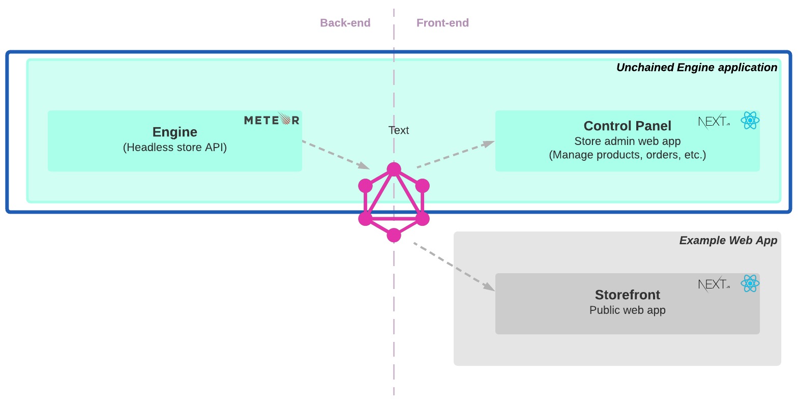

> In this section, we will walk you through the steps required to start up an Unchained Engine API server locally.
> To achieve this, we install and configure a new [Meteor](https://www.meteor.com/) app with the Unchained Engine included.



This tutorial helps you:

- Install and run locally the Meteor application with the Unchained Engine embedded.
- Access the local Control Panel example admin app
- Open the graphQL playground of your local Unchained Engine

.

## Step 1: Installation

1. First create a new folder for your project to be installed.

```bash
mkdir my-unchained-engine
cd my-unchained-engine
```

2. Use the Unchained initialisation script to download the code.

```bash
npm init @unchainedshop
```

3. A message prompts you to select the installation template. Choose **Unchained engine** by using the `down key` and press `enter`

```bash
? What type of template do you want ›
Full stack e-commerce
Storefront
Unchained engine <--
```

4. Next two steps are to select the directory, as we already created a new empty directory you can simply press `enter`, and whether you want to initialise git which is up to you.

```bash
? Directory name relative to current directory
 (press Enter to use current directory) ›
? Do you want Initialize git? no / yes
```

5. Install the npm packages

```bash
npm install
```

The installation script downloads, installs and initialises all files and packages required to build and run a new Meteor app that has the Unchained Engine backed in.

## Step 2: Start the Unchained Engine

```bash
meteor npm run dev
```

Open [localhost:4010](http://localhost:4010) to check if your meteor app is running correctly. You should see an **Login Screen**. Well, log-in!

**Username**: _admin@unchained.local_<br />
**Password**: _password_

You should see the following admin console in your browser (Yes, the UI can be improved. However, it's an admin console not visible to any customer).


[localhost:4010/graphql](http://localhost:4010/graphql) opens the graphQL playground for you to easily execute queries and mutations.

## Step 3: Add Products

If you want to setup the store and add products and categories using the control panel follow the instruction of the [Getting-Started](../getting-started/engine-controlpanel) guide using your local control panel instance under [localhost:4010](http://localhost:4010).

Follow the examples to learn about how to add products, initiate a check-out and use plugins with graphQL.

## Next steps

An easy way to test the Unchained Engine is to setup the test storefront web app created with [React.js](https://reactjs.org/) and [Next.js](https://nextjs.org/) locally and connect our local Unchained Engine graphQL API to it which is covered in the next chapter.
