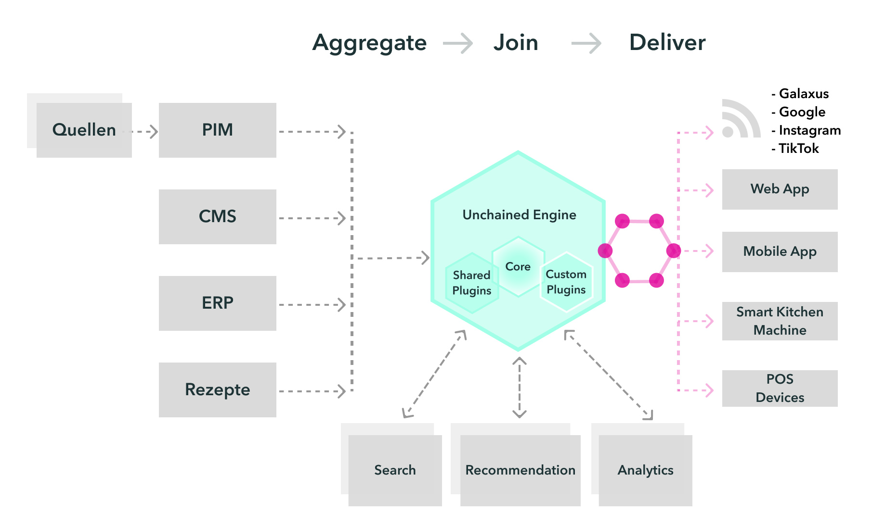

**Unchained Engine is a high-performance, open-source e-commerce and middleware framework for Node.js/Bun**

#### Core Design Principles of Unchained Engine:

- **Codeability**: Extend the system with endless possibilities, unrestricted by "customization" or settings.
- **GraphQL API**: Build modern, fully omni-channel storefronts.
- **Stateless architecture**: Scale horizontally and vertically.
- **Low Overhead**: We value simplicity and speed! Unchained runs on Node.js 22+ and Bun 1.1+, is pure ESM, and directly uses the native MongoDB driver.
- **Production readiness**: Used by companies running large B2C and B2B portals with 20,000+ articles and 100+ concurrent users.